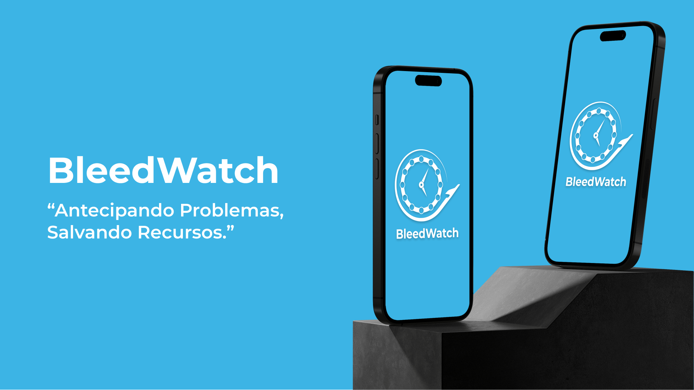

# Inteli - Instituto de Tecnologia e Liderança 

<p align="center">
<a href= "https://www.inteli.edu.br/"></a>
</p>

# BleedWatch

<p align="center">

</p>

## AeroGuardians

<p align="center">

</p>

## :student: Integrantes: 
- <a href="https://www.linkedin.com/in/gustavo-ferreira-oliveira/">Gustavo Ferreira de Oliveira</a>
- <a href="https://www.linkedin.com/in/gustavo-pereira1/">Gustavo Francisco Neto Pereira</a>
- <a href="https://www.linkedin.com/in/henriquemarlon/">Henrique Marlon Conceição Santos</a> 
- <a href="https://www.linkedin.com/in/jackson-aguiar/">Jackson Wellington Silva de Aguiar</a> 
- <a href="https://www.linkedin.com/in/kil-matheus-gomes-teixeira-78257020a/">Kil Matheus Gomes Teixeira</a>
- <a href="https://www.linkedin.com/in/luca-giberti-63a4ab231/">Luca Sarhan Giberti</a> 
- <a href="https://www.linkedin.com/in/lyorreisquintao">Lyorrei Shono Quintão</a>

## :teacher: Professores:
### Orientador(a) 
- <a href="https://www.linkedin.com/in/rodrigo-mangoni-nicola-537027158/">Rodrigo Mangoni Nicola</a>
### Instrutores
- <a href="https://www.linkedin.com/in/murilo-zanini-de-carvalho-0980415b/">Murilo Zanini de Carvalho</a>
- <a href="https://www.linkedin.com/in/cristinagramani/">Cristina Gramani</a> 
- <a href="https://www.linkedin.com/in/ricardo-jos%C3%A9-missori/">Ricardo José Missori</a> 
- <a href="https://www.linkedin.com/in/lisane-valdo/">Lisane Valdo</a>
- <a href="https://www.linkedin.com/in/gui-cestari/">Guilherme Cestari</a> 

## 📝 Descrição

O projeto tem como objetivo realizar uma análise de dados fornecidos pela companhia AZUL - Linhas Aéreas, utilizando Inteligência Artificial para identificar padrões e tendências que indiquem a necessidade de manutenção preditiva no sistema de BLEED dos motores da aeronave.

## 📝 Documentação do Projeto

A documentação do projeto pode ser consultada na pasta `documentos` do repositório.

Para acessar a documentação do projeto, clique [aqui](documentos/README.md).

## 📁 Estrutura de pastas

Dentre os arquivos presentes na raiz do projeto, definem-se:
```
.
├── documentos
├── src
│   ├── backend
│   │   ├── prisma
│   │   ├── src
│   │   │   ├── auth
│   │   │   ├── flight
│   │   │   ├── prisma
│   │   │   └── users
│   │   ├── test
│   │   └── Dockerfile
│   ├── lambdas
│   │   ├── etl
│   │   │    ├── services
│   │   │    └── Dockerfile
│   │   ├── prediction
│   │   │   ├── services
│   │   │   └── Dockerfile
│   ├── frontend
│   │   ├── public
│   │   └── src
│   │       ├── app
│   │       ├── assets
│   │       ├── components
│   │       ├── config
│   │       ├── contexts
│   │       └── utils
│   ├── modelo-ia
│   ├── notebooks
│   │   ├── data_analysis
│   │   ├── etl
│   │   └── models
└── README.md
```
### Especificações das pastas

- **documentos**: Esta pasta contém documentos, manuais ou outros recursos relacionados ao projeto que não são parte do código-fonte, como documentos de design, especificações ou documentação do usuário.

- **src**: Esta pasta é geralmente usada para armazenar o código-fonte do projeto. Pode ser dividida em várias subpastas, cada uma contendo uma parte específica do código.

  - **backend**: Esta subpasta contém o código-fonte relacionado ao backend do projeto, como servidores, APIs, bancos de dados, autenticação e assim por diante.

    - **prisma**: Uma subpasta que contém arquivos relacionados ao Prisma, que é uma ferramenta de acesso a banco de dados usada em muitos projetos Node.js.

    - **src**: Esta subpasta geralmente contém o código principal do backend, como controladores, rotas e lógica de negócios.

      - **auth**: Contém código relacionado à autenticação, como middleware e funções de autenticação.

      - **flight**: Contém código relacionado a recursos de voo, se aplicável ao projeto.

      - **prisma**: Mais uma vez, esta subpasta contém arquivos relacionados ao Prisma, especificamente para o backend.

      - **users**: Contém código relacionado a recursos de usuário, se aplicável ao projeto.

    - **test**: Esta subpasta contém testes automatizados para o código do backend.

    - **Dockerfile**: Este arquivo pode ser usado para definir a configuração Docker para o backend, permitindo que ele seja facilmente implantado em contêineres.

  - **etl-lambda**: Esta subpasta parece estar relacionada a uma função Lambda ETL (Extract, Transform, Load) e contém código e configurações específicas para essa função.

    - **prisma**: Novamente, esta subpasta contém arquivos relacionados ao Prisma, mas desta vez para a função Lambda.

    - **routes**: Contém código relacionado às rotas ou endpoints da função Lambda.

    - **services**: Contém código relacionado a serviços ou lógica de transformação de dados para a função Lambda.

    - **Dockerfile**: Como o Dockerfile anterior, este arquivo pode ser usado para configurar um contêiner para a função Lambda.

  - **frontend**: Esta subpasta contém o código-fonte relacionado à parte frontend do projeto, como interfaces de usuário, componentes e lógica do frontend.

    - **public**: Contém arquivos estáticos que são servidos diretamente para o navegador, como imagens, ícones ou arquivos HTML.

    - **src**: Contém o código principal do frontend.

      - **app**: Contém a configuração principal da aplicação, como as rotas e o ponto de entrada da aplicação.

      - **assets**: Contém recursos estáticos, como imagens ou arquivos de estilo.

      - **components**: Contém componentes reutilizáveis do frontend.

      - **config**: Contém configurações específicas do frontend.

      - **contexts**: Contém contextos do React ou outras configurações globais para o estado do aplicativo.

      - **utils**: Contém utilitários ou funções de utilidade usados em todo o frontend.

- **modelo-ia**: Esta pasta contém modelos de aprendizado de máquina ou outros recursos relacionados à inteligência artificial, se aplicável ao projeto.

- **notebooks**: Esta pasta contém Jupyter Notebooks ou outros documentos interativos usados para análise de dados ou experimentação, se aplicável ao projeto.

- **README.md**: Este é o arquivo que você está lendo agora. Ele serve como um guia e explicação geral sobre o projeto, fornecendo informações sobre como usar, configurar e entender o projeto. Geralmente, é uma boa prática incluir documentação detalhada aqui para ajudar outros colaboradores a entenderem o projeto.

## Especificação do Backend

Para construção do backend do sistema, foram utilizadas as seguintes tecnologias:

- NestJS: framework de Nodejs para server-side applications.
- Prisma: object relational mapper para migração e manipulação do banco de dados;
- TypeScript: linguagem de programação principal.
  
O NestJS utiliza a injeção de dependência para realizar o controle de dependências entre diferentes módulos e também mantê-los o mais desacoplados possível. A injeção de dependência é um padrão de projeto que permite que as classes recebam suas dependências de uma fonte externa em vez de criá-las internamente.

Em outras palavras, os serviços de manipulação do banco de dados do backend estão sendo injetados nos arquivos controladores. Ambos módulos podem ser identificados pelos decoradores `@Injectable()` e `@Controller()`.

## Especificação do Frontend

Para construção do frontend do sistema, foram utilizadas as seguintes tecnologias:

- React: biblioteca de construção de interfaçes web;
- NextJS: framework de React para aplicações web;
- TailwindCSS: framework de css para estilização de interfaces web;
- TypeScript: linguagem de programação principal.

NextJS é um framework para criação de interfaces web construído em cima do React, que permite a criação de Single Page Applications com suporte para SSR (Server Side Rendering) e CSR (Client Side Rendering). Além disso, traz um sistema de roteamento onde cada arquivo `page.jsx` dentro da pasta padrão `pages` corresponde a uma rota. No presente projeto, a pasta correspondente ao roteamento de páginas é `app`.
Foi utilizada também a biblioteca de estilos Tailwind, que traz classes de personalização de CSS prontas para uso.

## Especificação do Modelo de IA

Para construção do etl-lambda do sistema, foram utilizadas as seguintes tecnologias:

- Python: linguagem de programação principal.
- FastAPI: framework de Python para server-side applications.
- Prisma: object relational mapper para migração e manipulação do banco de dados;

O FastAPI é um framework de Python para construção de `APIs`. Ele é baseado no `Starlette` e `Pydantic`, e é especialmente rápido, fácil de aprender e fácil de usar. O FastAPI utiliza a injeção de dependência para realizar o controle de dependências entre diferentes módulos e também mantê-los o mais desacoplados possível. A injeção de dependência é um padrão de projeto que permite que as classes recebam suas dependências de uma fonte externa em vez de criá-las internamente.

## 💻 Execução do projeto

### Frontend

#### 📋 Pré-Requisitos

1. Instalar o NodeJS
2. Instalar o Docker
3. Instalar o Git
4. Instalar uma IDE de sua preferência (VSCode, PyCharm, etc)

#### Executando Localmente

1. Clone o repositório do projeto
2. Acesse a pasta `src/frontend`
3. Execute o comando `npm install` para instalar as dependências do projeto.
4. Execute o comando `next start` para iniciar o servidor local.
5. Acesse o endereço `http://localhost:3000` para acessar o dashboard do projeto.
6. Para parar o servidor, pressione `Ctrl + C` no terminal.

#### Executando com Docker

1. Clone o repositório do projeto
2. Acesse a pasta `src/frontend`
3. Execute o comando `docker build -t bleedwatch-frontend .` para criar a imagem do projeto.
4. Execute o comando `docker run -p 3000:3000 bleedwatch-frontend` para iniciar o servidor local.
5. Acesse o endereço `http://localhost:3000` para acessar o dashboard do projeto.
6. Para parar o docker, execute o comando `docker stop <container_id>` no terminal.

### Backend

#### 📋 Pré-Requisitos

1. Instalar o NodeJS
2. Instalar o Docker
3. Instalar o Git
4. Instalar uma IDE de sua preferência (VSCode, PyCharm, etc)

#### Executando Localmente

1. Clone o repositório do projeto
2. Acesse a pasta `src/backend`
3. Execute o comando `npm install` para instalar as dependências do projeto.
4. Execute o comando `npm run start:dev` para iniciar o servidor local.
5. Acesse o endereçoda api por `http://localhost:3001`.

#### Executando om Docker

1. Clone o repositório do projeto
2. Acesse a pasta `src/backend`
3. Execute o comando `docker build -t bleedwatch-backend .` para criar a imagem do projeto.
4. Execute o comando `docker run -p 3001:3001 bleedwatch-backend` para iniciar o servidor local.
5. Acesse o endereço `http://localhost:3001` para acessar a api do projeto.
6. Para parar o docker, execute o comando `docker stop <container_id>` no terminal.

### ETL-Lambda
#### 📋 Pré-Requisitos

1. Instalar o Python
2. Instalar as libs do arquivo requirements.txt
3. Instalar o Docker
4. Instalar o Git
5. Instalar uma IDE de sua preferência (VSCode, PyCharm, etc)

#### Executando Localmente

1. Clone o repositório do projeto
2. Acesse a pasta `src/etl-lambda`
3. Execute o comando `pip install -r requirements.txt` para instalar as dependências do projeto.
4. Execute o comando `uvicorn main:app --reload` para iniciar o servidor local.
5. Acesse o endereço `http://localhost:8001` para acessar a api do projeto.
6. Acesse o endpoint `http://localhost:8001/docs` para acessar a documentação da api do projeto.
7. Para parar o servidor, pressione `Ctrl + C` no terminal.

#### Executando com Docker

1. Clone o repositório do projeto
2. Acesse a pasta `src/etl-lambda`
3. Execute o comando `docker build -t etl-lambda .` para criar a imagem do projeto.
4. Execute o comando `docker run -p 8001:8001 etl-lambda` para iniciar o servidor local.
5. Acesse o endereço `http://localhost:8001` para acessar a api do projeto.
6. Acesse o endpoint `http://localhost:8001/docs` para acessar a documentação da api do projeto.
7. Para parar o docker, execute o comando `docker stop <container_id>` no terminal.

### Notebooks

#### 📋 Pré-Requisitos

1. Instalar o Python
2. Instalar o Jupyter Notebook
3. Instalar o Docker
4. Instalar o Git
5. Instalar uma IDE de sua preferência (VSCode, PyCharm, etc)

#### Executando Localmente

1. Clone o repositório do projeto
2. Instale o Jupyter Notebook: Se você ainda não tiver o Jupyter Notebook instalado, você pode instalá-lo usando o pip: `pip install notebook`
3. Acesse a pasta `src/notebooks`
4. Inicie o Jupyter Notebook: Execute o seguinte comando para iniciar o Jupyter Notebook: `jupyter notebook`
5. Abra o Notebook: No navegador, o Jupyter Notebook deve abrir e mostrar uma lista de arquivos na pasta. Clique no arquivo .ipynb do seu notebook para abri-lo.
6. Execute o Notebook: Dentro do notebook, você pode executar as células de código uma a uma ou todas de uma vez para interagir com o código e os resultados.

#### Executando com Google Colab

Se você preferir rodar o notebook diretamente no ambiente do Google Colab, siga estas etapas:

1. Acesse o Google Colab: Vá para `https://colab.research.google.com/` e faça login em sua conta do Google, se ainda não estiver conectado.
2. Carregue o Notebook: No Google Colab, clique em "Arquivo" (File) e selecione "Carregar notebook" (Upload notebook). Faça o upload do arquivo .ipynb do seu notebook.
3. Execute o Notebook: Você pode executar as células de código do notebook diretamente no Google Colab clicando em "Executar" (Run) ou pressionando Shift+Enter em cada célula.
4. Salve no Google Drive: Se desejar, você pode salvar o notebook no Google Drive clicando em "Arquivo" (File) e selecionando "Salvar uma cópia no Google Drive" (Save a copy to Google Drive).


## 📋 Licença/License

<p xmlns:cc="http://creativecommons.org/ns#" xmlns:dct="http://purl.org/dc/terms/"><a property="dct:title" rel="cc:attributionURL" href="https://github.com/Spidus/Teste_Final_1">MODELO GIT INTELI</a> by <a rel="cc:attributionURL dct:creator" property="cc:attributionName" href="https://www.yggbrasil.com.br/vr">Inteli, Gustavo Ferreira, Gustavo Pereira, Henrique Marlon, Jackson Wellington, Kil Teixeira, Luca Giberti, Lyorrei Shono.</a> is licensed under <a href="http://creativecommons.org/licenses/by/4.0/?ref=chooser-v1" target="_blank" rel="license noopener noreferrer" style="display:inline-block;">Attribution 4.0 International</a>.</p>

## 🎓 Referências

Aqui estão as referências usadas no projeto:

1. <https://creativecommons.org/share-your-work/>
2. <https://aws.amazon.com/pt/getting-started/>
3. <https://www.prisma.io/docs/>
4. <https://docs.nestjs.com/first-steps/>
5. <https://nextjs.org/learn/foundations/about-nextjs/>
