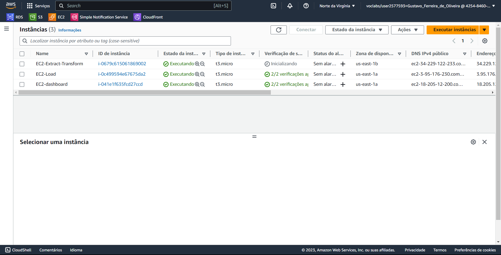

# Documentação Modelo Preditivo - Inteli

## 1. BleedWatch

<p align="center">

</p>

### 1.1. AeroGuardians

Gustavo Ferreira de Oliveira, Gustavo Francisco Neto Pereira, Henrique Marlon Conceição Santos, Jackson Wellington Silva de Aguiar, Kil Matheus Gomes Teixeira, Luca Sarhan Giberti, Lyorrei Shono Quintão.

## 2. Sumário

- [Documentação Modelo Preditivo - Inteli](#documentação-modelo-preditivo---inteli)
  - [1. BleedWatch](#1-bleedwatch)
    - [1.1. AeroGuardians](#11-aeroguardians)
  - [2. Sumário](#2-sumário)
  - [3. Problema](#3-problema)
    - [3.1. Descrição do Problema](#31-descrição-do-problema)
  - [4. Proposta de Solução](#4-proposta-de-solução)
    - [4.1. Definição da Proposta Geral do Sistema](#41-definição-da-proposta-geral-do-sistema)
      - [4.1.1. Componentes Principais](#411-componentes-principais)
      - [4.1.2. Benefícios Esperados](#412-benefícios-esperados)
      - [4.1.3. Stakeholders Envolvidos](#413-stakeholders-envolvidos)
    - [4.2. Levantamento de Requisitos da Prosposta de Solução](#42-levantamento-de-requisitos-da-prosposta-de-solução)
      - [4.2.1. Requisitos Funcionais](#421-requisitos-funcionais)
      - [4.2.2. Requisitos Não Funcionais](#422-requisitos-não-funcionais)
      - [4.2.3. Requisitos de Visualização](#423-requisitos-de-visualização)
  - [5. Contexto da Indústria](#5-contexto-da-indústria)
    - [5.1. Levantamento de Matérias-primas, Recursos, Processos e Impactos (Sociais e Ambientais)](#51-levantamento-de-matérias-primas-recursos-processos-e-impactos-sociais-e-ambientais)
    - [5.2. Canvas Proposta de Valor](#52-canvas-proposta-de-valor)
    - [5.3. Análise Financeira do Projeto](#53-análise-financeira-do-projeto)
      - [5.3.1. Levantamento dos custos de hospedagem](#531-levantamento-dos-custos-de-hospedagem)
      - [5.3.2. Analise de custos](#532-analise-de-custos)
    - [5.4. Matriz de oceano azul](#54-matriz-de-oceano-azul)
        - [5.4.1. Reduzir](#541-reduzir)
        - [5.4.2. Eliminar](#542-eliminar)
        - [5.4.3. Aumentar](#543-aumentar)
        - [5.4.4. Criar](#544-criar)
    - [5.5. Matriz de Riscos](#55-matriz-de-riscos)
    - [5.6. Proposta de Mitigação de Riscos](#56-proposta-de-mitigação-de-riscos)
      - [5.6.1. **Vazamento de dados:**](#561-vazamento-de-dados)
      - [5.6.2. **Erros graves na previsão:**](#562-erros-graves-na-previsão)
      - [5.6.3. **Granularidade dos dados**](#563-granularidade-dos-dados)
      - [5.6.4. **Dificuldade na escolha do algoritmo de IA apropriado**](#564-dificuldade-na-escolha-do-algoritmo-de-ia-apropriado)
      - [5.6.5. **Processo falho na coleta de dados**](#565-processo-falho-na-coleta-de-dados)
      - [5.6.6. **Investimento não proporcional aos benefícios alcançados**](#566-investimento-não-proporcional-aos-benefícios-alcançados)
      - [5.6.7. **Usabilidade não interativa a ponto de não proporcionar uma visualização e leitura corretas do output do modelo**](#567-usabilidade-não-interativa-a-ponto-de-não-proporcionar-uma-visualização-e-leitura-corretas-do-output-do-modelo)
  - [6. Arquitetura da Solução](#6-arquitetura-da-solução)
    - [6.1. Descrição dos Elementos Gerais da Solução Inicial](#61-descrição-dos-elementos-gerais-da-solução-inicial)
      - [6.1.1. Diagrama de blocos - v1.0](#611-diagrama-de-blocos---v10)
      - [6.1.2. Diagrama de blocos - v2.0](#612-diagrama-de-blocos---v20)
      - [6.1.3. Diagrama de blocos - v3.0](#613-diagrama-de-blocos---v30)
      - [6.1.4. Diagrama de blocos - v4.0](#614-diagrama-de-blocos---v40)
      - [6.1.5. Diagrama de blocos - v5.0](#615-diagrama-de-blocos---v50)
    - [6.2. Entendimento da arquitetura dos dados](#62-entendimento-da-arquitetura-dos-dados)
      - [6.2.1. Descrição dos Dados Coletados](#621-descrição-dos-dados-coletados)
      - [6.2.2. Descrição de Armazenamento dos Dados](#622-descrição-de-armazenamento-dos-dados)
      - [6.2.3. Descrição do Pré-processamento dos Dados](#623-descrição-do-pré-processamento-dos-dados)
      - [6.2.4. Descrição das Informações para Treinamento](#624-descrição-das-informações-para-treinamento)
      - [6.2.5. Infográfico Interativo](#625-infográfico-interativo)
      - [6.2.6. Diagrama de Arquitetura de Dados](#626-diagrama-de-arquitetura-de-dados)
        - [6.2.6.1. Diagrama de Arquitetura de Dados - v1.0](#6261-diagrama-de-arquitetura-de-dados---v10)
        - [6.2.6.2. Diagrama de Arquitetura de Dados - v2.0](#6262-diagrama-de-arquitetura-de-dados---v20)
        - [6.2.6.3. Diagrama de Arquitetura de Dados - v3.0](#6263-diagrama-de-arquitetura-de-dados---v30)
        - [6.2.6.4. Diagrama de Arquitetura de Dados - v4.0](#6264-diagrama-de-arquitetura-de-dados---v40)
        - [6.2.6.5. Diagrama de Arquitetura de Dados - v5.0](#6265-diagrama-de-arquitetura-de-dados---v50)
    - [6.3. Estudo de Viabilidade Técnica](#63-estudo-de-viabilidade-técnica)
      - [6.3.1. Tecnologia e Ferramentas Disponíveis](#631-tecnologia-e-ferramentas-disponíveis)
      - [6.3.2. Dados e Integração](#632-dados-e-integração)
      - [6.3.3. Recursos Humanos e Expertise](#633-recursos-humanos-e-expertise)
      - [6.3.4. Conformidade e Regulamentações](#634-conformidade-e-regulamentações)
      - [6.3.5. Custo e Tempo](#635-custo-e-tempo)
      - [6.3.6. Riscos e Desafios](#636-riscos-e-desafios)
      - [6.3.7. Conclusão](#637-conclusão)
  - [7. Desenvolvimento da Solução](#7-desenvolvimento-da-solução)
    - [7.1. Pipeline de Engenharia de Dados](#71-pipeline-de-engenharia-de-dados)
    - [7.2. Extract, Transform and Load - ETL](#72-extract-transform-and-load---etl)
      - [7.2.1. Obejtivo da Transformação dos dados](#721-obejtivo-da-transformação-dos-dados)
      - [7.2.2. Objetivo do carregamento dos dados](#722-objetivo-do-carregamento-dos-dados)
      - [7.2.3. Matriz de Decisão](#723-matriz-de-decisão)
    - [7.3. Armazenamento de Dados](#73-armazenamento-de-dados)
      - [7.3.1. Fonte dos Dados](#731-fonte-dos-dados)
      - [7.3.2. Diagrama do Banco de Dados](#732-diagrama-do-banco-de-dados)
        - [7.3.2.1. Diagrama do Banco de Dados - v1.0](#7321-diagrama-do-banco-de-dados---v10)
        - [7.3.2.2. Diagrama do Banco de Dados - v2.0](#7322-diagrama-do-banco-de-dados---v20)
      - [7.3.3. Sistema de Armazenamento](#733-sistema-de-armazenamento)
        - [7.3.3.1. **Fluxo:**](#7331-fluxo)
        - [7.3.3.2. **Justificativa do Design do Banco de Dados:**](#7332-justificativa-do-design-do-banco-de-dados)
        - [7.3.3.3. Explicação das colunas de cada tabela](#7333-explicação-das-colunas-de-cada-tabela)
          - [7.3.3.3.1. **Model User**](#73331-model-user)
          - [7.3.3.3.2. **Enum Role**](#73332-enum-role)
          - [7.3.3.3.3. **Model FlightFile**](#73333-model-flightfile)
          - [7.3.3.3.4. **Model FlightData**](#73334-model-flightdata)
        - [7.3.3.4. Corolário:](#7334-corolário)
    - [7.4. Backend (Desenvolvido com NestJS)](#74-backend-desenvolvido-com-nestjs)
      - [7.4.1. **Visão Geral**](#741-visão-geral)
      - [7.4.2. **Banco de Dados e ORM**](#742-banco-de-dados-e-orm)
      - [7.4.3. **Autenticação e Segurança**](#743-autenticação-e-segurança)
      - [7.4.4. **Processo de Upload e ETL**](#744-processo-de-upload-e-etl)
      - [7.4.5. **Rotas e Endpoints**](#745-rotas-e-endpoints)
        - [7.4.5.1. **Flight**](#7451-flight)
        - [7.4.5.2. **Authentication**](#7452-authentication)
        - [7.4.5.3. **Users**](#7453-users)
    - [7.5. Frontend (Desenvolvido com Next.js 13, Next-Auth e TailwindCSS)](#75-frontend-desenvolvido-com-nextjs-13-next-auth-e-tailwindcss)
      - [7.5.1. **Visão Geral**](#751-visão-geral)
      - [7.5.2. **Autenticação**](#752-autenticação)
        - [7.5.2.1. **Páginas e Funcionalidades**:](#7521-páginas-e-funcionalidades)
    - [7.6. Pesquisa exploratória sobre os recursos da interface](#76-pesquisa-exploratória-sobre-os-recursos-da-interface)
      - [7.6.1. Recursos Sonoros:](#761-recursos-sonoros)
      - [7.6.2. Paleta de Cores Coerente:](#762-paleta-de-cores-coerente)
      - [7.6.3. Clareza na Identificação de Elementos:](#763-clareza-na-identificação-de-elementos)
      - [7.6.4. Abas Principais:](#764-abas-principais)
      - [7.6.5. Alerta Visual:](#765-alerta-visual)
      - [7.6.6. Conclusão:](#766-conclusão)
    - [7.7. Machine Learning com Modelos Específicos](#77-machine-learning-com-modelos-específicos)
      - [7.7.1. Contrução do Modelo](#771-contrução-do-modelo)
        - [7.7.1.1. KNN](#7711-knn)
        - [7.7.1.2. Regressão Logística](#7712-regressão-logística)
        - [7.7.1.3. Árvore de Decisão](#7713-árvore-de-decisão)
      - [7.7.2. Conclusão](#772-conclusão)
    - [7.8. Machine Learning com AutoML PyCaret](#78-machine-learning-com-automl-pycaret)
      - [7.8.1. Construção do Modelo](#781-construção-do-modelo)
      - [7.8.2. Processo com PyCaret](#782-processo-com-pycaret)
      - [7.8.3. Conclusão e Passos Futuros](#783-conclusão-e-passos-futuros)
      - [7.8.4. Pipeline de Contrução do Modelo](#784-pipeline-de-contrução-do-modelo)
      - [7.8.5. Feature Engineering](#785-feature-engineering)
        - [7.8.5.1. **Hipótese: Feature Engineering para Simplificar e Consolidar Dados de Voo**](#7851-hipótese-feature-engineering-para-simplificar-e-consolidar-dados-de-voo)
        - [7.8.5.2. **Justificativa:**](#7852-justificativa)
        - [7.8.5.3. **Hipótese: Identificação de Padrões Temporais nos Dados de Voo**](#7853-hipótese-identificação-de-padrões-temporais-nos-dados-de-voo)
        - [7.8.5.4. **Justificativa:**](#7854-justificativa)
        - [7.8.5.5. **Consolidação e Melhoria do Modelo**](#7855-consolidação-e-melhoria-do-modelo)
          - [7.8.5.5.1. **Resultados Iniciais:**](#78551-resultados-iniciais)
          - [7.8.5.5.2. **Análise de Overfitting:**](#78552-análise-de-overfitting)
      - [7.8.6. **Implementação de IA**](#786-implementação-de-ia)
        - [7.8.6.1. **Atualização do ETL**](#7861-atualização-do-etl)
          - [7.8.6.1.1. **Nova Hipótese: Divisão dos Dados em Intervalos de 30 Linhas com Rotulação**](#78611-nova-hipótese-divisão-dos-dados-em-intervalos-de-30-linhas-com-rotulação)
        - [7.8.6.2. **Novo Modelo (Extra Tree)**](#7862-novo-modelo-extra-tree)
        - [7.8.6.3. **Oversampling**](#7863-oversampling)
        - [7.8.6.4. **Undersampling**](#7864-undersampling)
        - [7.8.6.5. **Próximos Passos:**](#7865-próximos-passos)
  - [8. Deploy da Solução](#8-deploy-da-solução)
    - [8.1. Fluxo de Configuração e Deploy](#81-fluxo-de-configuração-e-deploy)
      - [8.1.1. Configuração de variáveis de ambiente](#811-configuração-de-variáveis-de-ambiente)
      - [8.1.2. Configuração de credenciais](#812-configuração-de-credenciais)
      - [8.1.3. Configuração dos ambientes](#813-configuração-dos-ambientes)
  - [9.0 Consolidação da Proposta de ETL](#consolidação-da-proposta-de-etl)
    - [9.1 Armazenamento de Dados](#armazenamento-de-dados)
  - [10.0 Entendimento do Processo do ETL](#entendimento-do-processo-do-etl)
    - [10.1 Objetivo da Transformação de Dados](#objetivo-da-transformação-de-dados)
    - [10.2 Colunas Alteradas na Transformação de Dados](#colunas-alteradas-na-transformação-de-dados)
    - [10.3 Objetivo do Carregamento de Dados](#objetivo-do-carregamento-de-dados)
  - [11. Referências](#referências)
  - [12. Vídeo do funcionamento do Projeto](#vídeo-do-funcionamento-do-projeto)


## 3. Problema

### 3.1. Descrição do Problema

O sistema proposto é projetado para atender a um desafio específico enfrentado com as aeronaves, onde falhas no sistema de bleed dos motores podem resultar em um maior consumo de combustível. Essas falhas, apesar de não impedirem o voo, restringem a operação a um Flight Level (FL) mais baixo, aumentando a densidade e resistência do ar e consequentemente o consumo de combustível.

O objetivo é desenvolver um algoritmo de machine learning (utilizando métodos como SVM, Random Forest, XGBoost) que será capaz de detectar a degradação de componentes específicos que compõem o sistema de bleed. Esse algoritmo utilizará dados de voo decodificados  para prever a variável de falha.

## 4. Proposta de Solução

### 4.1. Definição da Proposta Geral do Sistema

#### 4.1.1. Componentes Principais

1. Engenharia de Dados: Criação e gerenciamento de um banco de dados em nuvem, com decodificação de dados de voo para consumo pelo algoritmo.
2. Análise de Correlação: Avaliação e seleção de variáveis com alto grau de correlação com a variável de falha, utilizando métodos como Pearson Correlation ou Mutual Information Scores.
3. Desenvolvimento de Algoritmo de ML: Implementação do algoritmo de machine learning para detectar a degradação do componente.
4. Pipeline de Processamento na AWS: Desenvolvimento de uma pipeline robusta e segura na AWS para processar e implementar o modelo.

#### 4.1.2. Benefícios Esperados

1. Redução significativa do consumo de combustível.
2. Minimização de atrasos e cancelamentos.
3. Abordagem preditiva para a manutenção, aumentando a eficiência operacional.
4. Redução das restrições operacionais para os pilotos.

#### 4.1.3. Stakeholders Envolvidos

1. Diretoria Técnica: Engenharia e MCC (Maintenance Control Center) para atuação preditiva.
2. Diretoria de Operações: Redução do consumo de combustível e remoção de restrições operacionais.
3. Clientes da Companhia Aérea: Menos atrasos e cancelamentos e um serviço mais sustentável.

### 4.2. Levantamento de Requisitos da Prosposta de Solução

Para   o   desenvolvimento   do   projeto   foi   necessário   o   levantamento   de requisitos. A base dos requisitos foi pensada pela equipe de desenvolvedores e seus orientadores.  Nenhum  sistema  foi  usado como  base,  por  serem  distintos  do objetivo do projeto.

#### 4.2.1. Requisitos Funcionais

Os Requisitos Funcionais foram inicialmente pensados com base em entrevista com os clientes (funcionários da Azul). Suas colocações foram norteadoras especialmente para os requisitos funcionais pertinentes para as funcionalidades que tanto da visualização de dados, modelo de machine learning e banco de dados vem realizar respectivamente.

Os demais Requisitos Funcionais - relacionados à estruturação do projeto foram idealizados em discussão entre os participantes do grupo, após análise do documento disponibilizado pelo orientador, denominado TAPI e o onboarding e apresentação do orientador sobre a problemática.

Em suma, a elaboração dos Requisitos Funcionais presentes abaixo deu-se a partir de discussão entre o grupo em encontros de desenvolvimento do projeto presenciais, baseando-se em nosso conhecimento acumulado na modelagem de sistemas e experiências de usuário.

| código | **Requisito Funcional**                                                                                                                                                                                                                                                                                                                                                                                                                                                                                                                                           |
| ------- | ----------------------------------------------------------------------------------------------------------------------------------------------------------------------------------------------------------------------------------------------------------------------------------------------------------------------------------------------------------------------------------------------------------------------------------------------------------------------------------------------------------------------------------------------------------------------- |
| RF 01   | A infraestrutura deve ser baseada em contêineres e serviços em nuvem para acomodar o armazenamento de dados, garantindo flexibilidade e adaptabilidade ao ambiente do sistema.                                                                                                                                                                                                                                                                                                                                                                                        |
| RF 02   | O modelo de ML deve ter a capacidade de realizar previsões de falha em pelo menos um componente, utilizando técnicas de análise de dados para identificar possíveis problemas antes que ocorram.                                                                                                                                                                                                                                                                                                                                                                    |
| RF 03   | Deve ser estabelecida uma integração completa entre o modelo de predição, o banco de dados e o sistema de coleta de dados, permitindo um fluxo contínuo e eficiente de informações entre esses elementos.                                                                                                                                                                                                                                                                                                                                                        |
| RF 04   | O Dashboard deve fornecer uma interface de visualização de dados que permita aos usuários analisar de maneira intuitiva e interativa as previsões de degradação e falha dos componentes do sistema, facilitando a identificação de tendências, padrões e anomalias relevantes para a tomada de decisões preventivas. A visualização deve ser adaptável a diferentes escalas de tempo e detalhes, oferecendo gráficos, tabelas e recursos de filtragem para uma compreensão completa e eficaz dos resultados gerados pelo algoritmo de machine learning. |
| RF 05   | A documentação do projeto deve ser abrangente descrevendo detalhadamente o funcionamento do sistema, as técnicas de predição empregadas, os processos de integração e a utilização da interface de usuário, a fim de garantir a compreensão e manutenção adequadas do projeto.                                                                                                                                                                                                                                                                             |
| RF 06   | O Dashboard deve contemplar um sistema de notificação que alertará os usuários sobre previsões de degradação ou falha iminente, permitindo que a equipe tome medidas preventivas a tempo.                                                                                                                                                                                                                                                                                                                                                                        |
| RF 07   | O Dashboard deve possuir um mecanismo que permita o gerenciamento contínuo dos modelos de machine learning, possibilitando a atualização e retreinamento com novos dados periodicamente para manter a precisão do algoritmo.                                                                                                                                                                                                                                                                                                                                        |
| RF 08   | Deve-se integrar um módulo ou componente de monitoramento em tempo real que acompanhe os dados de entrada e saída do algoritmo, possibilitando a detecção de possíveis anomalias ou desempenho abaixo do esperado.                                                                                                                                                                                                                                                                                                                                                 |
| RF 09   | A API deve possuir um sistema de controle de acesso que restrinja o acesso aos dados, modelos e resultados apenas a usuários autorizados, garantindo a segurança e confidencialidade das informações.                                                                                                                                                                                                                                                                                                                                                               |
| RF 10   | Deve-se desenvolver uma API que permita o salvamento de dados históricos usados para treinamento e validação dos modelos, a fim de possibilitar análises retrospectivas e aprimoramentos futuros.                                                                                                                                                                                                                                                                                                                                                                 |
| RF 11   | Um banco de dados deve ser criado, permitindo o salvamento dos dados.                                                                                                                                                                                                                                                                                                                                                                                                                                                                                                   |
| RF 12   | Deve ser implementado um serviço de monitoramento de eventos do banco de dados, capaz de rastrear e registrar alterações e atividades realizadas no banco de dados.                                                                                                                                                                                                                                                                                                                                                                                                  |

#### 4.2.2. Requisitos Não Funcionais

Os requisitos não funcionais foram inicialmente pensados com base nas discussões realizadas entre os integrantes do grupo, os demais professores e orientadores. As considerações de cada ponto foram analisadas criticamente, uma vez que os stakeholders deixaram o escopo aberto em relação à parte dos requisitos não funcionais.

| código | **Requisito Não Funcional**                                                                                                                          |
| ------- | ------------------------------------------------------------------------------------------------------------------------------------------------------------ |
| RNF 01  | A API deve possuir uma resposta às consultas dentro de 1 segundo, priorizando a funcionalidade sobre a otimização do tempo de resposta.                   |
| RNF 02  | A API deve suportar pelo menos 5 consultas simultâneas do modelo de IA.                                                                                     |
| RNF 03  | A API deve algum tipo de criptografia padrão para dados em trânsito.                                                                                       |
| RNF 04  | A API deve possuir alguma implementação de autenticação básica com nome de usuário e senha                                                             |
| RNF 05  | A AWS deve possuir acesso restrito ao modelo e aos dados através do seu serviço, denominado Identity and Access Management (IAM).                          |
| RNF 06  | A AWS deve possuir armazenamento seguro e criptografado dos dados.                                                                                           |
| RNF 07  | A infraestrutura deve escalar automaticamente com base na demanda e necessidades de adição de recursos.                                                    |
| RNF 08  | O modelo de Machine Learning deve possuir 80% de confiabilidade, permitindo alguma flexibilidade para manutenção e atualizações.                         |
| RNF 09  | A documentação básica do código e da arquitetura deverá existir e ser entregue no final do projeto para facilitar futuros desenvolvimentos e melhorias. |
| RNF 10  | O modelo de Machine Learning deve possuir versionamento, permitindo a capacidade de atualizar e reverter o modelo sem interrupções no funcionamento.       |
| RNF 11  | O modelo de Machine Learning deve possuir testes contínuos de modelo e  pipeline para garantir a integridade.                                               |
| RNF 12  | O modelo de Machine Learning deve armazenar logs por no mínimo 6 meses para análise básica.                                                               |
| RNF 13  | O modelo de Machine Learning deve possuir monitoramento contínuo do desempenho e da saúde da pipeline.                                                     |
| RNF 14  | O modelo de Machine Learning deve possuir o registro completo de todas as previsões, decisões e ações do modelo.                                         |
| RNF 15  | O modelo de Machine Learning deve possuir padrões básicos de segurança de dados aplicáveis.                                                              |
| RNF 16  | O modelo de Machine Learning deve possuir conformidade com LGPD e outros regulamentos de privacidade aplicáveis.                                            |
| RNF 17  | O modelo de Machine Learning deve possuir capacidade de operar em várias regiões da AWS, atendendo aos requisitos de localização dos dados.              |

O foco de um MVP é validar o conceito central do projeto, por isso os requisitos não funcionais são normalmente menos rigorosos do que em uma versão completa do produto. A ideia é estabelecer uma base sólida que possa ser expandida e refinada em futuras iterações, com base no feedback e nas necessidades identificadas durante a fase de MVP.

#### 4.2.3. Requisitos de Visualização

Durante a primeira conversa com os stakeholders da Azul, foi constatado que a vizualição dos dados não era algo extemamente valioso para eles e sim a maneira como será construido o modelo ML e a API. Embora este apontamento realizado. Entendemos que a construção de um dashboar de vizualição, pode ajudar os stakeholder adotarem padrãos ou insights.

Desta formo o grupo chegou a conclusão de alguns componentes e requisitos que o shadboard deverá conter para facilitar a visualização:

| Componente                                 | Necesidade                                                                                     | Opção                                                                                                                                           | Possibilidade de acesso                                                                                         |
| ------------------------------------------ | ---------------------------------------------------------------------------------------------- | ------------------------------------------------------------------------------------------------------------------------------------------------- | --------------------------------------------------------------------------------------------------------------- |
| Componente de histórico                   | Análise do histórico de dados para identificar padrões de desempenho ao longo do tempo.     | Gráficos de linha ou gráficos de área que mostram a variação dos parâmetros do sistema ao longo do tempo.                                   | Dashboard de análise de dados acessível aos engenheiros de manutenção para revisar registros históricos.  |
| Componente de previsões e recomendações | Receber previsões sobre o desempenho futuro do sistema e recomendações de manutenção.     | Painéis que mostram previsões de falhas, estimativas de vida útil restante de componentes e sugestões de manutenção preventiva.             | Dashboard acessível com plotagem da informação em destaque para os engenheiros de manutenção e analistas. |
| Componente de comparação entre aeronaves | Comparar o desempenho do sistema de "bleed" entre diferentes aeronaves.                        | Gráficos de barras ou gráficos de dispersão para comparar métricas-chave, como eficiência do sistema, falhas passadas e tempo de vida útil. | Ferramenta de comparação acessível aos engenheiros de manutenção e analistas.                              |
| Componente de alertas e notificações     | Receber alertas imediatos quando os dados indicarem problemas ou possíveis falhas no sistema. | Painéis de destaque que mostram alertas claramente, com cores distintas e mensagens claras.                                                      | Alertas podem ser enviados por meio de aplicativos móveis, e-mails ou sistemas de mensagens internos.          |
| Componente de filtragem                    | Filtrar as informações com base em dastas, nome, id e se houve falha.                        | Botão em diferentes partes do dashboard que permita a filtragem.                                                                                 | Realização da filtragem com base nas necessidades dos engenheiros de manutenção e analistas.               |

## 5. Contexto da Indústria

### 5.1. Levantamento de Matérias-primas, Recursos, Processos e Impactos (Sociais e Ambientais)

A Azul Linhas Aéreas é uma empresa que atua há vários anos no mercado aeronáutico e turístico, oferecendo diversos tipos de serviços, desde passagens aéreas até a manutenção de aeronaves. A empresa possui uma frota de aeronaves de grande porte que é usada para atender à demanda de seus clientes. Ao longo desses anos, a empresa tem impactado o meio em que atua por meio do consumo de matérias-primas, recursos e processos, além de gerar impactos sociais e ambientais, que podem ser observados mesmo sem acesso a muitos dados específicos da empresa. Após a leitura do briefing, foi possível identificar alguns desses impactos, como por exemplo:

- **Matérias-Primas e Recursos:**

1. **Combustíveis:** A companhia aérea depende principalmente de combustíveis de aviação, como o querosene de aviação (QAV), derivado do petróleo, para o funcionamento de suas aeronaves.
2. **Energia:** A empresa também depende de energia elétrica para operar seus escritórios, hangares, aeroportos e para recarregar as baterias das aeronaves.
3. **Matérias-Primas em Geral:** A Azul também depende de matérias-primas para a manutenção e construção de suas aeronaves, como peças e ferramentas, que são fabricadas a partir de matérias-primas naturais.

- **Processos:**

1. **Operações de Voo:** A Azul também é responsável pelo planejamento de rotas, decolagem, voo e aterrissagem.
2. **Manutenção de Aeronaves:** A empresa realiza o processo de manter as aeronaves em condições seguras e eficientes por meio de manutenções regulares e reparos quando necessário.
3. **Operações Terrestres:** São os processos de embarque, desembarque, movimentação de bagagem, entre outros, nos aeroportos onde a empresa atua.

- **Impactos (Sociais e Ambientais):**

1. **Emissões de Carbono:** A indústria da aviação é um grande emissor de dióxido de carbono (CO2) e outros gases de efeito estufa devido ao consumo de combustíveis fósseis. No entanto, a Azul está comprometida em reduzir suas emissões de carbono e trabalha para diminuir as emissões em 80% até 2050.
2. **Ruído:** As aeronaves da frota da Azul geram poluição sonora, afetando as comunidades próximas aos aeroportos.
3. **Geração de Empregos e Renda:** A Azul gera empregos e renda para milhares de pessoas, tanto diretamente quanto indiretamente, por meio de seus serviços e operações.
4. **Turismo:** A Azul também contribui para o setor de turismo, permitindo que as pessoas viajem para diferentes lugares do mundo.

### 5.2. Canvas Proposta de Valor

O Canvas Proposta de Valor é uma ferramenta visual que organiza de forma concisa os elementos essenciais da proposta de valor de um produto ou serviço. Após entrevistar o parceiro, o Framework obteve informações valiosas para construir a solução. O Canvas destacou os pontos-chave de valor, facilitando decisões e comunicação efetiva, os quais podem ser visualizados na imagem abaixo.

<p align="center">

</p>

Para vizualização completa, [acesse o link.](https://www.figma.com/file/QvLMb7GVUXkpDsli5HJKSW/Value-Proposition-Canvas?type=whiteboard&node-id=0%3A1&t=swcH2yKrMBSK922j-1)

### 5.3. Análise Financeira do Projeto

A análise financeira desempenha um papel crucial na tomada de decisões empresariais informadas e estratégicas. É um processo que envolve a avaliação de informações financeiras e econômicas para compreender a saúde financeira de uma organização, projetar seu desempenho futuro e tomar decisões embasadas em dados. Essa análise abrange uma variedade de aspectos, incluindo avaliação de investimentos, gerenciamento de riscos, planejamento orçamentário e otimização de recursos.

A tabela a seguir ilustra uma estimativa dos gastos para um projeto de porte similar com duração de um ano. Incluem-se os custos relacionados aos funcionários, como salários e despesas convertidas segundo as leis trabalhistas CLT, bem como os valores associados ao equipamento necessário. Estes números se baseiam em médias salariais para cada cargo, obtidas a partir de referências como o <a href="https://www.catho.com.br/profissoes/"> Catho Profissões </a> e <a href="https://www.glassdoor.com/Salaries/index.htm"> Glassdoor Salaries </a>. Além disso, as cifras foram adaptadas para a contratação em regime CLT utilizando a ferramenta disponível no <a href="https://www.idinheiro.com.br/calculadoras/calculadora-custo-de-funcionario-para-empresa/"> iDinheiro </a>, buscando assim um valor próximo à realidade.

Os serviços da AWS foram calculados como um pacote de serviços, pressupondo que esse combo custe US$1000 e que o custo é realizado é feita pela conversão do mesmo para o real durante todos os meses.

| Cargo                  | Descrição                                                                                                                                                                                                                                                                                               | Quantidade | Salário Mensal             | Valor acrescido imposto/CLT                  | Duração (Meses) | Total Acumulado        |
| ---------------------- | --------------------------------------------------------------------------------------------------------------------------------------------------------------------------------------------------------------------------------------------------------------------------------------------------------- | ---------- | --------------------------- | -------------------------------------------- | ----------------- | ---------------------- |
| Estagiário            | Próximo do fim da Graduação, responsável por ajuda no desenvolvimento de forma crescente conforme desempenha um papel fundamental.                                                                                                                                                                    | 1          | R$2,000.00    | R$4,034.44  | 6                                            | R$24,206.64       |                        |
| UX Design/Research     | É responsável pela criação de produtos e serviços digitais que atendam às necessidades, desejos e expectativas dos usuários de maneira eficaz e agradável.                                                                                                                                        | 1          | R$6,800.00    | R$10,861.11 | 12                                           | R$130,333.32      |                        |
| Engenheiro de Dados    | Responsável pela área de ciência de dados e análise de dados, focando principalmente na coleta, armazenamento, processamento e disponibilização de dados para análise.                                                                                                                             | 1          | R$8,000.00    | R$12,567.78 | 12                                           | R$150,813.36      |                        |
| Engenheiro de Software | Os engenheiros de software são responsáveis por desenvolver e manter o código da IA. Eles também são responsáveis por garantir que a IA seja segura e eficiente.                                                                                                                                    | 1          | R$6,200.00    | R$10,007.78 | 12                                           | R$120,093.36      |                        |
| PO                     | Profissional responsável por liderar a equipe de desenvolvimento.                                                                                                                                                                                                                                        | 1          | R$10,200.00   | R$15,696.67 | 12                                           | R$188,360.04      |                        |
| Serviços da AWS       | Amazon S3                                                                                                                                                                                                                                                                                                 | 1          | $111.00       | R$4,900.00  | 12                                           | R$58,800.00       |                        |
|                        | Amazon Dashboard                                                                                                                                                                                                                                                                                          | 1          | $111.00                     |                                              |                   |                        |
|                        | Amazon Elastic IP                                                                                                                                                                                                                                                                                         | 3          | $333.00                     |                                              |                   |                        |
|                        | Amazon Bucket                                                                                                                                                                                                                                                                                             | 1          | $111.00                     |                                              |                   |                        |
|                        | Amazon Data Pipeline                                                                                                                                                                                                                                                                                      | 1          | $111.00                     |                                              |                   |                        |
|                        | Amazon EC2                                                                                                                                                                                                                                                                                                | 3          | $333.00                     |                                              |                   |                        |
|                        | Amazon RDS                                                                                                                                                                                                                                                                                                | 1          | $111.00                     |                                              |                   |                        |
|                        | Amazon Lookout for Metrics                                                                                                                                                                                                                                                                                | 1          | $111.00                     |                                              |                   |                        |
|                        | Amazon CloudWatch                                                                                                                                                                                                                                                                                         | 1          | $111.00                     |                                              |                   |                        |
| Máquina               | **Processador**: Intel Core i7-12700K ou AMD Ryzen 9 5900X `<br>` **Memória**: 32 GB DDR4-3200 `<br>` **Armazenamento**: 1 TB SSD `<br>` **Placa de vídeo**: NVIDIA GeForce RTX 3070 ou AMD Radeon RX 6800 XT `<br>` **Sistema operacional**: Windows 10 ou Linux | N/A        | N/A                         | R$12,500.00  | 1               | R$12,500.00 |                   |                        |
|                        | **Total**                                                                                                                                                                                                                                                                                           |            |                             |                                              |                   | **R$530,566.76** |

#### 5.3.1. Levantamento dos custos de hospedagem

Presumindo 1 instancia ec2 com t3.large em uso constante em um servidor dedicado com ubuntu pro em uso sob demanda tem os seguintes custos:

1 instances x 0.0917 USD On Demand hourly cost x 730 hours in a month = 66.941000 USD

Dedicated Per Region Fee: 730 hours x 2 USD = 1460.000000 USD

**On-Demand instances (monthly): 1526.941000 USD**

O custo de armanezamento de dados na aws só exise em uso sob demanda, usando uma db.m1.large com 2 vcpue 7,5 gig de memoria vai ter os seguintes custos:

1 instance(s) x 0.49 USD hourly x (100 / 100 Utilized/Month) x 730 hours in a month = 357.7000 USD

**Amazon RDS PostgreSQL instances cost (monthly): 357.70 USD**

**Amazon RDS PostgreSQL instances cost (upfront): 0.00 USD**

Somando o custo da instancia do modelo e do armazenamento dos dados tem o custo mensal de **1884.641. Esse valor não considera custos antecipados.**

O total do ano deu US$ 22,961.28 por ano, ou 1,913.44 USD por mes. Esse valor inclui custos antecipados.

Lembrando que só é uma estimativa dos preços, segue o link da calculadora de custos de hospedagem que usamos, [acesse o link](https://calculator.aws/#/estimate?id=1106550270298e2184a7a775b6e8c0e3512fb87b)

#### 5.3.2. Analise de custos

O nosso modelo atualmente roda em uma instancia no EC2. Essa instancia tem um custo de aproximademente 1500 USD por mês(o numero exato pode ser visto no relatório gerado da aws). Esse custo foi está quebrado em 4 items, instancia dedicada, o sistema operacional (ubuntu pro), uso constante e o tipo da instancia (t3.large). O tipo da instancia foi selecionado porque é o suficiente para rodar o modelo e ter um pouco de capcidade de sobra em casos de spike. O uso constante foi selecionado porque não temos como saber quando uma predição vai ser usado por conta fatores que estão fora do nosso controle. A sistema operacional não tem como mudar porque é o SO que está funcionado nosso projeto.  A instancia dedicada foi escolhida principalmente pela questão de segurança dos dados envolvidos na predição e por uma questão de performance.

### 5.4. Matriz de oceano azul

A Matriz de Oceano Azul é um conceito estratégico desenvolvido com a abordagem de propor uma nova forma de pensar sobre estratégias de negócios, buscando a criação de um novo espaço de mercado no qual a concorrência é irrelevante ou praticamente inexistente. Em contraste com o "Oceano Vermelho", onde as empresas competem em mercados saturados e disputam uma fatia limitada de demanda, o Oceano Azul envolve a criação de um mercado completamente novo ou a redefinição de um mercado existente de maneira única.

| Atributos                                 | BleedWatch | Fracctal | Skywise |
| ----------------------------------------- | ---------- | -------- | ------- |
| **Tempo de Inatividade**            | 6          | 8        | 10      |
| **Custos de Manutenção**          | 8          | 5        | 8       |
| **Manutenções Repentinas**        | 9          | 6        | 7       |
| **Falta de Comunicação**          | 8          | 7        | 7       |
| **Confiança Operacional**          | 8          | 5        | 7       |
| **Eficiência da Frota**            | 7          | 6        | 8       |
| **Modelos Preditivos Avançados**   | 9          | 6        | 7       |
| **Plataforma de Análise de Dados** | 7          | 6        | 7       |

A Matriz de Oceano Azul também traz os pilares de ação que são: Eliminar, Reduzir, Aumentar e Criar, para ajudar a entender como a empresa pode se diferenciar no mercado. Por meio desse, foi possível identificar os pilares de ação para o projeto, sendo eles:

##### 5.4.1. Reduzir

- Tempo de Inatividade: Reduzir o tempo de inatividade das aeronaves através de previsões mais precisas para a manutenção, minimizando os atrasos e cancelamentos de voos.
- Custos de Manutenção: Reduzir os custos de manutenção ao otimizar os intervalos de manutenção.

##### 5.4.2. Eliminar

- Manutenções repentinas: Eliminar manutenções repentinas que podem ocorrer mesmo com uma análise prévia humana.
- Falta de Comunicação: Eliminar a falta de comunicação entre equipes de manutenção e operações, estabelecendo canais eficazes para compartilhamento de informações em tempo real.

##### 5.4.3. Aumentar

- Confiança Operacional: Aumentar a confiança operacional, garantindo que as aeronaves estejam sempre em condições ideais de voo.
- Eficiência da Frota: Com nossa ferramenta de análise de dados, prevemos necessidades de manutenção ao identificar padrões. Reduzindo manutenções preventivas excessivas, otimizamos o tempo de voo das aeronaves, aumentando a capacidade operacional e garantindo um serviço confiável aos clientes.

##### 5.4.4. Criar

- Modelos Preditivos Avançados: Criar modelos preditivos avançados que utilizem aprendizado de máquina e análises estatísticas para prever falhas e problemas de manutenção.
- Plataforma de Análise de Dados: Criar uma plataforma centralizada para análise de dados de manutenção, permitindo que as equipes tomem decisões informadas.

Para vizualização completa da matriz de oceano azul, [acesse o link.](https://docs.google.com/spreadsheets/d/1mzm0HoD2YwsmdwwifubfHPnqYBq6Qq-U/edit?usp=sharing&ouid=102412916866947981392&rtpof=true&sd=true)

### 5.5. Matriz de Riscos

A matriz de riscos é uma ferramenta que auxilia na identificação dos riscos e na priorização dos mesmos. A matriz de riscos é composta por dois eixos, o eixo X que representa a probabilidade de ocorrência do risco e o eixo Y que representa o impacto que o risco pode causar no projeto. A partir da intersecção dos dois eixos, é possível identificar a prioridade do risco. Quanto mais à direita e acima o risco estiver, maior é a sua prioridade. Sendo assim, após o entendimento do projeto e conversar com os stakeholders da Azul, foi possível identificar os riscos e montar a matriz de riscos do projeto.

<p align="center">

</p>

Para vizualização comple ta matriz de risco, [acesse o link.]()

### 5.6. Proposta de Mitigação de Riscos

Nossa proposta de mitigação de riscos leva em consideração a melhor forma possível para poder mitigá-los na solução. Cada risco será mitigado das seguintes formas:

#### 5.6.1. **Vazamento de dados:**

Construiremos nossa solução da forma mais segura possível, mantendo a qualidade do nosso produto. Isso será feito através de um sistema de autenticação e autorização para garantir acesso limitado aos dados. Também será realizada a criptografia dos dados para adicionar mais uma camada de segurança.

#### 5.6.2. **Erros graves na previsão:**

Minimizaremos os erros graves na previsão da melhor forma possível, sem prejudicar o restante do projeto. Faremos isso da seguinte maneira: começaremos com uma análise profunda dos dados, identificando padrões que levem a erros graves.

Depois, aprimoraremos a engenharia de características, criando novas variáveis relevantes e lidando com desequilíbrios nos dados, se estiverem presentes. Em seguida, faremos a escolha de algoritmos robustos e utilizaremos técnicas de ensemble para agregar previsões de diferentes modelos. Após isso, implementaremos uma validação cruzada estratégica, atentando-nos à distribuição das classes. Além disso, dedicaremos esforços à detecção e correção de outliers, utilizando métodos apropriados.

#### 5.6.3. **Granularidade dos dados**

Para mitigar o risco relacionado à granularidade dos dados na etapa de ETL, onde faremos as alterações necessárias para ajustar a granularidade aos requisitos do nosso modelo de previsão, seguiremos uma abordagem direcionada. Começaremos por identificar a granularidade ideal para as nossas previsões, considerando se os dados estão agregados demais ou detalhados demais. Realizaremos desagregações ou agregações conforme necessário, utilizando técnicas de transformação de dados com cuidado para manter a qualidade. Testaremos rigorosamente as transformações, validando a integridade dos dados e a precisão das previsões resultantes.

Manteremos uma comunicação clara com as partes interessadas e documentaremos todas as mudanças realizadas. Avaliaremos o impacto das alterações no desempenho do modelo, garantindo que as métricas estejam melhorando ou, no mínimo, se mantenham estáveis. Com essas etapas, asseguraremos que as mudanças na granularidade dos dados sejam realizadas de maneira eficaz e benéfica para o nosso projeto como um todo.

#### 5.6.4. **Dificuldade na escolha do algoritmo de IA apropriado**

Para mitigar o risco de escolher o algoritmo de IA mais adequado diante da dificuldade, estamos seguindo um processo sistemático. Começamos por compreender os requisitos do projeto e pesquisamos uma ampla gama de algoritmos de IA. Analisamos minuciosamente nossos dados, identificando suas características e relacionamentos. Implementamos testes com diversos algoritmos, avaliando-os por métricas relevantes e aplicando validação cruzada para generalização. Através de experimentação iterativa, ajustamos hiperparâmetros e exploramos diferentes abordagens para otimizar o desempenho.

Ao longo do processo, obtivemos feedback de especialistas e documentamos cada etapa, incluindo resultados de testes e justificativas para a escolha final. Reservando um conjunto de dados não visto para validação final, garantimos que o algoritmo escolhido demonstre uma capacidade robusta de generalização. Para sustentar a qualidade contínua, estabelecemos um sistema de monitoramento. Assim, estamos mitigando a dificuldade na seleção do algoritmo de IA, baseando nossa escolha em uma abordagem abrangente e embasada em dados, assegurando que a solução escolhida atenda de forma eficaz e duradoura às necessidades do projeto.

#### 5.6.5. **Processo falho na coleta de dados**

Para mitigar o risco de um processo falho na coleta de dados, estamos adotando medidas estratégicas. Começamos avaliando cuidadosamente as suposições feitas no processo de ETL e determinamos que a maneira mais eficaz de mitigar esse risco é aprimorar nossa coleta de dados em si. Estamos focando em melhorar a qualidade dos dados por meio da implementação de verificações rigorosas durante a coleta, validação em tempo real e pré-processamento para garantir consistência e validação dos dados. Além disso, estamos diversificando as fontes de dados, automatizando e monitorando nosso processo de coleta, e mantendo uma comunicação constante com as partes interessadas para identificar e resolver problemas rapidamente.

Estamos também analisando tendências e anomalias nos dados para detectar possíveis falhas e implementando uma revisão contínua para melhorar nosso processo com base em feedback e experiência. Ao adotar essas abordagens, estamos assegurando que os dados que coletamos sejam confiáveis, precisos e completos, reduzindo significativamente o risco de falhas em nosso processo de coleta e garantindo uma base sólida para nossas atividades de análise e tomada de decisões.

#### 5.6.6. **Investimento não proporcional aos benefícios alcançados**

Para mitigar o risco de investimento não proporcional aos benefícios alcançados, estamos adotando medidas direcionadas. Inicialmente, estamos realizando uma análise rigorosa de custo-benefício, avaliando não apenas os aspectos financeiros, mas também os recursos e esforços envolvidos. Estabelecemos metas claras e mensuráveis, permitindo uma avaliação objetiva dos resultados em relação aos investimentos feitos. Para otimizar a alocação de recursos, estamos considerando a divisão do projeto em fases menores e testes piloto antes de investimentos em grande escala. Acompanharemos indicadores-chave de desempenho para monitorar continuamente os benefícios alcançados.

Priorizaremos a flexibilidade, ajustando nossa estratégia com base em resultados intermediários e mantendo comunicação constante com as partes interessadas. Isso nos permitirá reavaliar as decisões de investimento à medida que o projeto avança, garantindo que cada passo esteja alinhado com os benefícios esperados.

#### 5.6.7. **Usabilidade não interativa a ponto de não proporcionar uma visualização e leitura corretas do output do modelo**

Para garantir a usabilidade interativa e a visualização precisa do output do modelo, estamos adotando medidas específicas. Estamos desenvolvendo uma interface de usuário intuitiva e responsiva, com elementos visuais claros, como gráficos e tabelas, para apresentar os resultados de maneira compreensível. Além disso, estamos enfatizando a interpretabilidade do modelo, fornecendo explicações para as decisões tomadas. Também estamos coletando feedback por meio de testes de usabilidade e prototipagem iterativa para ajustes contínuos.

Disponibilizaremos documentação detalhada e tutoriais para orientar os usuários na interação com a interface e na interpretação dos resultados. Canais de suporte ao cliente serão oferecidos para esclarecer dúvidas e resolver questões relacionadas à usabilidade. Com essas ações, estamos assegurando que a usabilidade interativa da interface ofereça uma visualização precisa e clara do output do modelo, capacitando os usuários a tomar decisões informadas e eficazes com base nas informações apresentadas.

## 6. Arquitetura da Solução

### 6.1. Descrição dos Elementos Gerais da Solução Inicial

Para a primeira versão do projeto, o grupo considerou utilizar tecnologias que estão presentes no escopo do projeto e também fazem parte do ciclo de aprendizagem dos alunos da turma de Engenharia da Computação. Dessa forma, facilitando o desenvolvimento do projeto e, consequentemente, a aprendizagem dos alunos que estarão atuando na linha de desenvolvimento.

O projeto será composto por 5 vertentes, sendo elas o: Dashboard, AWS (ambiente de hospedagem em nuvem), Machine Learning (ML), API e Banco de dados. Abaixo você era encontrar a descrição de cada ponto.

1. **Dashboard:**

   - O dashboard será a interface de visualização dos dados, permitindo que os usuários visualizem os dados de maneira intuitiva e clara. Ele será desenvolvido utilizando algum dos serviços oferecidos pela AWS para essa modalidade de visualização de dados.
2. **AWS:**

   - A AWS, por sua vez, será o ambiente de hospedagem em nuvem onde os dados serão armazenados e processados. Ela será utilizada para hospedar o dashboard, o banco de dados, a API e o modelo de ML.
3. **Machine Learning:**

   - O modelo de ML será desenvolvido utilizando a linguagem de programação Python e os arquivos Parquet disponibilizados pela Azul. Serão levados em consideração artigos científicos relevantes para sua construção. O grupo também está considerando a utilização de um dos serviços de AutoML da AWS para o desenvolvimento do modelo.
4. **API:**

   - A API será um serviço desenvolvido para que o modelo de ML possa ser acessado pelo dashboard. A linguagem de programação utilizada para a construção da API ainda não foi escolhida, mas a escolha entre Node.js ou Nest.js está sendo cogitada. A API será hospedada na AWS.
5. **Banco de dados:**

   - O banco de dados será desenvolvido por meio da ferramenta de ORM Prisma, uma ferramenta de código aberto para Node.js e TypeScript que facilita o acesso ao banco de dados. O banco de dados será hospedado na AWS no serviço RDS, permitindo o uso do serviço RDS Event Notifications para o monitoramento de eventos do banco de dados.

A seguir, você encontrará o diagrama de blocos com o fluxo de funcionamento do projeto.

#### 6.1.1. Diagrama de blocos - v1.0

<p align="center">

</p>

Para vizualização completa do diagrana de blocos, [acesse o link.](https://www.figma.com/file/XMc4eHKap0hMnj3kiqM5U7/Diagrama-de-blocos?type=whiteboard&node-id=0%3A1&t=meAhJacaTuHb0XUL-1)

#### 6.1.2. Diagrama de blocos - v2.0

<p align="center">

</p>

Para vizualização completa do diagrana de blocos, [acesse o link.](https://www.figma.com/file/XMc4eHKap0hMnj3kiqM5U7/Diagrama-de-blocos?type=whiteboard&node-id=0%3A1&t=meAhJacaTuHb0XUL-1)

#### 6.1.3. Diagrama de blocos - v3.0

<p align="center">

</p>

Para vizualização completa do diagrana de blocos, [acesse o link.](https://www.figma.com/file/XMc4eHKap0hMnj3kiqM5U7/Diagrama-de-blocos?type=whiteboard&node-id=0%3A1&t=meAhJacaTuHb0XUL-1)

#### 6.1.4. Diagrama de blocos - v4.0

<p align="center">

</p>

Para vizualização completa do diagrana de blocos, [acesse o link.](https://www.figma.com/file/XMc4eHKap0hMnj3kiqM5U7/Diagrama-de-blocos?type=whiteboard&node-id=0%3A1&t=meAhJacaTuHb0XUL-1)

#### 6.1.5. Diagrama de blocos - v5.0

<p align="center">

</p>

Para vizualização completa do diagrana de blocos, [acesse o link.](https://www.figma.com/file/XMc4eHKap0hMnj3kiqM5U7/Diagrama-de-blocos?type=whiteboard&node-id=0%3A1&t=meAhJacaTuHb0XUL-1)

### 6.2. Entendimento da arquitetura dos dados

#### 6.2.1. Descrição dos Dados Coletados

Os dados coletados fornecidos pela Azul se resumem em 2534 arquivos do tipo "PARQUET" decodificados, que contêm aproximadamente 90 colunas nos conjuntos de dados. A disponibilização desses arquivos logo na primeira Sprint torna-se algo relevante e crucial, pois permite estudar os dados, elaborar possíveis estratégias e planos para as próximas sprints, além de identificar possíveis problemas e discutir com os parceiros. Embora o grande número de colunas, algumas não mostraram relevância real para a construção do modelo de Machine Learning, levando-nos a removê-las do conjunto de dados.

Essas informações provêm de 17 aeronaves do modelo E2, com valores registrados em intervalos de 50 milissegundos, capturando informações detalhadas sobre o desempenho dos componentes e sensores das aeronaves durante voos. É válido ressaltar que esses dados vêm em formato bruto, incluindo valores nulos ou zeros, o que não indica má qualidade dos dados, mas sim a necessidade de atenção ao tratá-los.

A seleção das colunas a serem utilizadas para a construção do modelo de Machine Learning foi feita previamente pelos stakeholders da Azul. Eles disponibilizaram a descrição completa e os nomes em uma tabela no documento de introdução e apresentação do projeto, chamado TAPI, juntamente com outros arquivos e documentos. Nesse material, pudemos visualizar informações básicas cruciais para o projeto, além das áreas em que os stakeholders esperam que trabalhemos.

Durante esse período inicial, os stakeholders da Azul escolheram colunas para focar na análise de indicadores de falhas, denominadas especificamente "Message0418DAA1" e "Message0422DAA1". Esses dados "y" (conforme descrito no TAPI) representam eventos de falha relacionados ao sistema BLEED. A falha desse sistema pode levar ao aumento do consumo de combustível, considerando o número de aeronaves do modelo E2 na frota, o que pode resultar em um grande gasto com combustível.

Em conclusão, o projeto tem como objetivo estudar e identificar a correlação entre as 45 colunas de dados escolhidas pelos stakeholders da Azul, com a finalidade de construir e executar um modelo de Machine Learning que contribua para aprimorar a eficácia das estratégias de manutenção preditiva, garantindo a segurança e operação das aeronaves do modelo E2.

#### 6.2.2. Descrição de Armazenamento dos Dados

Toda a estrutura de armazenamento de dados foi pensada a nível de implementação completa da infraestrutura na AWS. Por meio de conversas com os stakeholders, tivemos o insight de que o dashboard deve ser capaz de enviar os arquivos .PARQUET, que serão salvos no serviço Bucket S3 da AWS. A partir disso, os dados passarão pela etapa de ETL (Extração, Transformação e Carregamento), atravessando a API de Integração e sendo salvos em uma tabela no banco de dados.

Através do serviço de RDS Event Notification, que irá monitorar todo esse processo primário, será disparado o retreinamento do modelo. Posteriormente, o Data Pipeline entrará em ação, seguido pelo deploy em um serviço de instância EC2 ou EKS.

Durante a construção do projeto, espera-se utilizar um banco de dados não relacional para, em primeiro momento, armazenar essas informações pré-processadas. Em um segundo momento, serão armazenados os dados com base nas predições realizadas.

#### 6.2.3. Descrição do Pré-processamento dos Dados

Para fins de análise e exploração iniciais, um notebook do Colab foi estruturado com tais finalidades. Isso incluía a autenticação de segurança, o download dos dataframes, a filtragem das colunas a serem efetivamente utilizadas, a conversão das colunas para float/int64 a fim de diminuir o tamanho dos conjuntos de dados e respeitar o tipo de coluna binária exigido pelos arquivos "PARQUET". Por fim, houve a junção dos dataframes com tratamento de valores nulos. O grupo também considera utilizar AutoML para o pré-processamento dos dados, devido a indicação realizado por um especialista de Machine Learning da AWS, onde ele destacou dois serviços denominado "Lookout for Elements" e "Lookout for Metrics", que podem fazer o pré-processamento da melhor forma possivel.

Mesmo que o grupo não siga pelo caminho da utilização deste serviços, ainda iremos tentar rodar os dados após a limpeza dos dados para ver se um dos serviços nos conse dar algum tipo de insight em relação aos dados, pois aparentemente o "Lookout for Metrics" consegue realizar esse tipo de ação. Também iremos seguir o framework "Well Architected - Machine Learning" da AWS, ao qual possui uma sessão de indição de pré-processamento de dados.

Apesar do projeto estar no inicio, o grupo tem se deparado com desafios ao tentar unir mais de 300 arquivos .PARQUET de uma vez. Isso ocorre porque excede a capacidade de memória RAM do Colab, mesmo após otimizações do código e tentativas de redução do custo de processamento. Também é válido ressaltar que o grupo disponibilizou uma das versões iniciais do notebook do Colab para a turma.

#### 6.2.4. Descrição das Informações para Treinamento

Durante o processo de ML, o grupo tem cogitado seguir alguns caminhos que estão passando por fase de desenvolvimento lógico para determinar o melhor. O primeiro é realizar o processo de junção e limpeza dos dados de forma apropriada para ser utilizado pelo AutoML, por meio dos serviços Lookout for Elements ou Lookout for Metrics. Para seguir esse caminho, os integrantes têm consultado o artigo "Forecasting fault events for predictive maintenance using data-driven techniques and ARMA modeling", disponibilizado pelo professor orientador.

O segundo caminho que tem sido considerado é utilizar alguma forma de divisão do conjunto de dados, onde exista mais de um modelo, permitindo que um conjunto de dados possa focar diretamente no lado da turbina A, e outro conjunto de dados possa focar no lado da turbina B. Isso não indicará diretamente qual peça pode estar prestes a falhas, mas sim o quão perto pode existir algum problema em cada lado.

Pelo fato de estarmos na primeira Sprint de desenvolvimento, esses planos ainda são hipóteses a serem trabalhadas e testadas, pois ambas exigem uma visão mais aprofundada dos dados que foram fornecidos e a disponibilidade de acesso à AWS.

#### 6.2.5. Infográfico Interativo


Para vizualização completa do infográfico, [acesse o link](https://www.canva.com/design/DAFrL5RaSoY/_QXoMrWhHDpKu9qNRCaeyQ/edit?utm_content=DAFrL5RaSoY&utm_campaign=designshare&utm_medium=link2&utm_source=sharebutton).

**Referências para a construção do infográfico:**

[Guide ML - Microsoft](https://learn.microsoft.com/pt-br/azure/architecture/data-guide/technology-choices/data-science-and-machine-learning?view=azureml-api-2)

[Artigo - O que é machine learning e quais são as 7 etapas do aprendizado das máquinas](https://blog.idwall.co/o-que-e-machine-learning/#:~:text=A%20etapa%20do%20treinamento%20%C3%A9,principal%20pilar%20do%20machine%20learning.)

[Artigo - Implementação de Machine Learning: Do início ao fim](https://www.programmers.com.br/blog/implementacao-de-machine-learning-do-inicio-ao-fim/)

#### 6.2.6. Diagrama de Arquitetura de Dados

O diagrama de arquitetura de dados tem como objetivo mostrar a estrutura de armazenamento de dados, desde a coleta até a disponibilização para o usuário final. A estrutura foi pensada em nível de implementação completa da infraestrutura na AWS. Por meio de conversas com os stakeholders, tivemos a ideia de que o dashboard deve ser capaz de enviar os arquivos .PARQUET ou .CSB, que serão salvos no serviço Bucket S3 da AWS. A partir disso, os dados passarão pela etapa de ETL (Extração, Transformação e Carregamento), atravessando a API de Integração e sendo salvos em uma tabela no banco de dados. Posteriormente, o Data Pipeline entrará em ação, seguido pelo deploy em um serviço de instância EC2 ou EKS. Durante a construção do projeto, espera-se utilizar um banco de dados não relacional para, em primeiro momento, armazenar essas informações pré-processadas. Em um segundo momento, os dados com base nas predições realizadas também serão armazenados. Abaixo é possível encontrar o diagrama de arquitetura de dados de forma visual e descritiva.

##### 6.2.6.1. Diagrama de Arquitetura de Dados - v1.0

<p align="center">

</p>

Para vizualização completa do diagrama de arquitetura de dados, [acesse o link](https://www.figma.com/file/QwuJiAF0Chqo6VwvuTSxP4/Diagrama-de-arquitetura-de-dados?type=whiteboard&node-id=0%3A1&t=ZXPkfzwYYz2pI7nR-1).

##### 6.2.6.2. Diagrama de Arquitetura de Dados - v2.0

<p align="center">

</p>

Para vizualização completa do diagrama de arquitetura de dados, [acesse o link](https://www.figma.com/file/QwuJiAF0Chqo6VwvuTSxP4/Diagrama-de-arquitetura-de-dados?type=whiteboard&node-id=0%3A1&t=ZXPkfzwYYz2pI7nR-1).

##### 6.2.6.3. Diagrama de Arquitetura de Dados - v3.0

<p align="center">

</p>

Para vizualização completa do diagrama de arquitetura de dados, [acesse o link](https://www.figma.com/file/QwuJiAF0Chqo6VwvuTSxP4/Diagrama-de-arquitetura-de-dados?type=whiteboard&node-id=0%3A1&t=ZXPkfzwYYz2pI7nR-1).

##### 6.2.6.4. Diagrama de Arquitetura de Dados - v4.0

<p align="center">

</p>

Para vizualização completa do diagrama de arquitetura de dados, [acesse o link](https://www.figma.com/file/QwuJiAF0Chqo6VwvuTSxP4/Diagrama-de-arquitetura-de-dados?type=whiteboard&node-id=0%3A1&t=ZXPkfzwYYz2pI7nR-1).

##### 6.2.6.5. Diagrama de Arquitetura de Dados - v5.0

<p align="center">

</p>

Para vizualização completa do diagrama de arquitetura de dados, [acesse o link](https://www.figma.com/file/QwuJiAF0Chqo6VwvuTSxP4/Diagrama-de-arquitetura-de-dados?type=whiteboard&node-id=0%3A1&t=ZXPkfzwYYz2pI7nR-1).

### 6.3. Estudo de Viabilidade Técnica

O estudo da viabilidade técnica avalia se um projeto é realizável do ponto de vista tecnológico e logístico. Para o projeto de desenvolver um algoritmo de machine learning para detectar falhas no sistema de bleed dos motores das aeronaves Embraer E2, aqui está um estudo detalhado da viabilidade técnica:

#### 6.3.1. Tecnologia e Ferramentas Disponíveis

1. Machine Learning Models (SVM, Random Forest, XGBoost):
   Essas tecnologias são bem estabelecidas e amplamente utilizadas na indústria, com bibliotecas e ferramentas prontamente disponíveis.
2. AWS para Pipeline de Processamento:
   A AWS oferece uma variedade de serviços que podem ser integrados para construir uma pipeline de processamento robusta e escalável.

#### 6.3.2. Dados e Integração

1. Disponibilidade de Dados:
   O acesso e decodificação de dados de voo serão vitais. A qualidade e quantidade dos dados podem afetar a precisão do modelo.
2. Integração com o Sistema Existente:
   A integração do algoritmo com os sistemas de bordo atuais e com os sistemas de manutenção deve ser considerada, o que pode exigir colaboração e conformidade com padrões da indústria.

#### 6.3.3. Recursos Humanos e Expertise

1. Equipe Qualificada:
   A equipe precisará ter habilidades em machine learning, engenharia de dados, computação em nuvem (especificamente AWS) e conhecimento da aviação.

#### 6.3.4. Conformidade e Regulamentações

1. Normas de Aviação:
   Como envolve sistemas críticos de aeronaves, o projeto deve estar em conformidade com as regulamentações da aviação e padrões de segurança.

#### 6.3.5. Custo e Tempo

1. Orçamento: O desenvolvimento, teste e implementação podem ser dispendiosos, dependendo da complexidade e das necessidades do projeto.
2. Cronograma: A implementação completa pode levar vários meses, considerando o desenvolvimento, teste e certificações necessárias.

#### 6.3.6. Riscos e Desafios

1. Complexidade da Detecção de Falhas:
   O sistema de bleed dos motores é complexo, e a detecção de falhas pode ser desafiadora.
2. Segurança de Dados:
   Como os dados serão armazenados e processados na nuvem, as preocupações com a segurança dos dados devem ser abordadas.

#### 6.3.7. Conclusão

O projeto é tecnicamente viável, com tecnologias e abordagens bem estabelecidas disponíveis. No entanto, a complexidade da integração com sistemas existentes, a conformidade com regulamentações da aviação e a necessidade de uma equipe altamente qualificada podem representar desafios. Um planejamento cuidadoso, uma análise rigorosa dos requisitos e uma colaboração estreita com as partes interessadas, incluindo especialistas em aviação, serão cruciais para o sucesso do projeto.

## 7. Desenvolvimento da Solução

### 7.1. Pipeline de Engenharia de Dados

A Pipeline de Engenharia de Dados consiste no processo de extração, transformação e carregamento de dados. Essa pipeline é essencial para o projeto, pois é responsável por realizar o pré-processamento dos dados, etapa crucial para a construção do modelo de Aprendizado de Máquina. Esse processo ocorre para garantir que os dados estejam limpos e prontos para serem usados em análises e visualizações.

A pipeline de ETL será desenvolvida utilizando o serviço Data Pipeline da AWS, que permite a criação de pipelines de processamento de dados executados em intervalos regulares. A pipeline de ETL será composta por 3 etapas, a saber:

1. **Extract:** Nessa etapa, os dados serão inseridos em arquivos PARQUET no Dashboard e, posteriormente, enviados para o Bucket S3 da AWS. Esse bucket funcionará como uma espécie de "banco de dados" para os dados brutos.
2. **Transform:** Aqui, os dados brutos serão transformados em dados limpos. Serão removidos valores nulos e duplicados, os dados do tipo float serão convertidos para integer e haverá agrupamento dos dados de acordo com as features escolhidas.
3. **Load:** Nessa etapa, os dados limpos serão carregados no banco de dados, que será implementado no serviço RDS da AWS.

Dessa forma, no projeto, esse processo foi desenvolvido da seguinte maneira:

1. O usuário acessa o Dashboard e carrega os arquivos PARQUET.
2. Os arquivos são enviados por meio da API para um Bucket S3 da AWS.
3. O Data Pipeline é acionado e executa o processo de ETL.
4. Os dados limpos são carregados no banco de dados, onde serão salvos em uma tabela no serviço RDS da AWS.

Por meio desse processo, os dados brutos são transformados em dados limpos e armazenados em um banco de dados, onde poderão ser acessados para treinar ou re-treinar o modelo de Aprendizado de Máquina.

Vale ressaltar que o processo de ETL foi desenvolvido no projeto de forma exploratória, a fim de atestar a qualidade dos dados e verificar as features indicadas pelos stakeholders. O notebook do Colab com o código desenvolvido pode ser encontrado no repositório do projeto, na pasta "notebooks".

A integração do sistema como um todo tem ocorrido por meio do desenvolvimento de uma API, responsável por integrar, por exemplo, o Dashboard com o banco de dados e outros serviços da AWS. A API será construída utilizando a linguagem de programação TypeScript, além de alguns serviços Lambda da AWS, que permitem a execução de código sem a necessidade de provisionar ou gerenciar servidores, uma vez que estará sendo executada em um serviço EC2 da AWS. A versão inicial da API já está disponível no repositório do projeto, na pasta "src/backend".

Para um melhor entendimento e visualização do que foi desenvolvido até o momento, a documentação do projeto pode ser consultada para obter instruções sobre como executar a aplicação.

### 7.2. Extract, Transform and Load - ETL

#### 7.2.1. Obejtivo da Transformação dos dados

A transformação de dados é um componente crucial em muitos processos de análise e ciência de dados. Ela se refere ao processo de converter ou mapear dados de um formato "bruto" para outro formato que seja mais apropriado para uma variedade de tarefas subsequentes. No contexto apresentado, o objetivo da transformação de dados foi preparar e condensar um grande volume de dados recebidos de um parceiro, tornando-o mais manejável para análise e modelagem.

Recebemos uma grande quantidade de dados de um parceiro, totalizando aproximadamente 90GB, organizados em diversos arquivos no formato parquet. Cada um destes arquivos representa dados de um voo específico de uma aeronave da Azul. Esses dados abrangem informações de vários sensores da aeronave, incluindo duas características (features) que sinalizam falhas no sistema de bleed da mesma.

Devido à vastidão desses dados, enfrentamos desafios computacionais para processá-los em sua totalidade de uma única vez. Portanto, para facilitar a manipulação e análise, decidimos realizar uma etapa de ETL (Extração, Transformação e Carga). A meta desse processo foi condensar a informação de cada arquivo parquet, que representa um voo completo, em apenas uma linha.

Para condensar e transformar os dados de nossos arquivos parquet, aplicamos métodos específicos de agregação para cada coluna. A tabela a seguir descreve os métodos de agregação usados:

| Nome da Coluna            | Método de Agregação |
| ------------------------- | ---------------------- |
| amscHprsovDrivF-1a        | sum                    |
| amscHprsovDrivF-1b        | sum                    |
| amscHprsovDrivF-2b        | sum                    |
| amscPrsovDrivF-1a         | sum                    |
| amscPrsovDrivF-1b         | sum                    |
| amscPrsovDrivF-2b         | sum                    |
| basBleedLowPressF-1a      | sum                    |
| basBleedLowPressF-2b      | sum                    |
| basBleedLowTempF-1a       | sum                    |
| basBleedLowTempF-2b       | sum                    |
| basBleedOverPressF-1a     | sum                    |
| basBleedOverPressF-2b     | sum                    |
| basBleedOverTempF-1a      | sum                    |
| basBleedOverTempF-2b      | sum                    |
| bleedFavTmCmd-1a          | sum                    |
| bleedFavTmCmd-1b          | max                    |
| bleedFavTmCmd-2a          | sum                    |
| bleedFavTmCmd-2b          | sum                    |
| bleedFavTmFbk-1a          | max                    |
| bleedFavTmFbk-1b          | max                    |
| bleedFavTmFbk-2b          | max                    |
| bleedHprsovCmdStatus-1a   | sum                    |
| bleedHprsovCmdStatus-1b   | sum                    |
| bleedHprsovCmdStatus-2a   | sum                    |
| bleedHprsovCmdStatus-2b   | sum                    |
| bleedHprsovOpPosStatus-1a | sum                    |
| bleedHprsovOpPosStatus-1b | sum                    |
| bleedHprsovOpPosStatus-2a | sum                    |
| bleedHprsovOpPosStatus-2b | sum                    |
| bleedMonPress-1a          | max                    |
| bleedMonPress-1b          | max                    |
| bleedMonPress-2a          | max                    |
| bleedMonPress-2b          | max                    |
| bleedOnStatus-1a          | sum                    |
| bleedOnStatus-1b          | sum                    |
| bleedOnStatus-2b          | sum                    |
| bleedOverpressCas-2a      | sum                    |
| bleedOverpressCas-2b      | sum                    |
| bleedPrecoolDiffPress-1a  | max                    |
| bleedPrecoolDiffPress-1b  | max                    |
| bleedPrecoolDiffPress-2a  | max                    |
| bleedPrecoolDiffPress-2b  | max                    |
| bleedPrsovClPosStatus-1a  | sum                    |
| bleedPrsovClPosStatus-2a  | sum                    |
| bleedPrsovFbk-1a          | sum                    |
| message0422DAA-1          | max                    |
| message0418DAA-1          | max                    |

**Nota:** O método de agregação pode variar de `sum`, `max`, `min` a `median` dependendo da coluna.

Por exemplo, para a coluna "amscHprsovDrivF-1a", optamos por somar todos os seus valores, enquanto para a coluna "bleedFavTmFbk-1a", escolhemos registrar o valor máximo.

Essa estratégia de agregação resultou na criação de um arquivo CSV conciso, onde cada linha corresponde a um voo e as colunas representam as informações agregadas de interesse. Com esse formato mais compacto, nossa intenção é desenvolver um modelo de aprendizado de máquina que possa prever falhas no sistema de bleed das aeronaves. Entretanto, vale destacar que nosso processo é iterativo: após treinar o modelo inicial e avaliar seu desempenho, podemos retornar à fase de ETL para ajustes, aprimorando a transformação dos dados conforme necessário. Esse método nos permite refinar nossos modelos e melhorar nossa precisão ao longo do tempo.

#### 7.2.2. Objetivo do carregamento dos dados

O carregamento de dados é uma etapa crucial no processo de análise e modelagem de dados. Nesta seção, descreveremos o objetivo do carregamento de dados, identificando quais dados serão carregados no processo e a necessidade por trás dessa atividade.
O objetivo do carregamento de dados é transferir os dados pré-processados e condensados a partir de um determinado formato de arquivo, sendo que na primeira versão do código esse formato é CSV, para um banco de dados, facilitando o acesso, armazenamento e manipulação dos dados. A transformação prévia dos dados, que ocorre na etapa de ETL (Extração, Transformação e Carga), visa a compilação das informações relevantes em um formato mais manejável para análises subsequentes. O carregamento desses dados em um banco de dados permite a persistência das informações de forma estruturada, preparando o terreno para a construção e treinamento de modelos de aprendizado de máquina.
Os dados a serem carregados compreendem variáveis que representam características críticas do sistema de bleed, tais como pressões, temperaturas, status das válvulas e comandos de controle. O carregamento dessas variáveis possibilitará a criação de um modelo analítico destinado a prever falhas com base em padrões e correlações.
O código de carregamento de dados é responsável por transferir os dados pré-processados e condensados de um arquivo CSV para um banco de dados. O código do arquivo data-saving.py combina a funcionalidade das bibliotecas pandas e SQLAlchemy para automatizar o processo de carregamento de dados no banco de dados. Isso permite que os dados estejam prontos para análises mais aprofundadas.
Em suma, o código realiza as seguintes operações:
**Definição da Estrutura da Tabela:** É definida uma classe chamada AirplaneData, que representa a estrutura da tabela no banco de dados. Cada coluna na tabela é representada por um atributo na classe.
**Criação da Tabela:** É criada uma conexão com o banco de dados através da ORM (_Object Relational Mapper_) SQLAlchemy e é utilizada a classe definida anteriormente para criar a tabela correspondente.
**Carregamento dos Dados:** O arquivo CSV contendo os dados condensados é lido usando a biblioteca pandas. As colunas do DataFrame são renomeadas para corresponder às colunas da tabela no banco de dados.
**Iteração e Carregamento:** O código itera pelas linhas do DataFrame, cria instâncias da classe AirplaneData e atribui os valores das colunas a essas instâncias. Um ID único é gerado para cada instância.
**Inserção no Banco de Dados:** As instâncias são adicionadas ao banco de dados e as transações são confirmadas por meio do comando commit().

#### 7.2.3. Matriz de Decisão

Uma matriz de decisão é uma ferramenta que ajuda a tomar decisões de forma organizada e lógica, especialmente quando há várias opções e critérios a considerar. Ela é usada para comparar diferentes alternativas e visualizar como cada opção se sai em relação a critérios importantes.

No contexto da nossa aplicação, desenvolvemos cinco abordagens de ETL usando os dados fornecidos pelo cliente. Essas abordagens permitiram que cada membro do grupo tivesse a oportunidade de aprender e contribuir ativamente. Contudo, dentre essas tentativas, apenas duas delas conseguiram produzir resultados notáveis e relevantes para a solução. Isso levou a um direcionamento mais concentrado de esforços em relação a essas duas abordagens promissoras.

No próximo passo, diante dos modelos promissores, apresentamos a criação de uma matriz de decisão. Nessa matriz, cada critério é avaliado com uma pontuação que varia de 0 a 5, com o objetivo de proporcionar uma avaliação mais concreta e quantitativa.

| Critérios                   | Modelo 1 (HM) | Modelo 2 (GO) |
| ---------------------------- | ------------- | ------------- |
| Quantidade de Dados pós ETL | 2             | 3             |
| Interpretabilidade           | 4             | 3             |
| Robustez                     | 3             | 4             |
| Consumo de Recursos          | 5             | 5             |

Certamente, é importante enfatizar que esses valores ainda podem estar sujeitos a alterações, uma vez que o projeto está em seus estágios iniciais de desenvolvimento. Além disso, é relevante mencionar que o cliente comprometeu-se a fornecer mais fontes de dados para integrar à solução. Portanto, os resultados apresentados acima são apenas aproximados e podem ser refinados à medida que o projeto avança e novas informações são incorporadas. Isso demonstra a natureza dinâmica do processo de desenvolvimento e a disposição de ajustar e otimizar a solução com base em dados adicionais.

### 7.3. Armazenamento de Dados

#### 7.3.1. Fonte dos Dados

Os dados fornecidos tem como origem os proprios stakeholders da Azul, que disponibilizaram os dados em formato de arquivos "PARQUET". Esses dados foram disponibilizados por meio do envio em formato ".zip" para o professor orientador que posteriormente disponibilizou os arquivos para os alunos da turma de Engenharia da Computação.

Por mais que o projeto não exija a utilização de um banco de dados relacional, o grupo optou por utilizar o postgress devido a sua facilidade de manipulação de dados e também por ser um banco de dados que os integrantes da equipe já possuem conhecimento. O postgress, também possui metodos e ferramentas que facilitam na manipulação de fluxo grande de dados, pois conseguimos fazer a indexação de colunas da tabela por exemplo.

#### 7.3.2. Diagrama do Banco de Dados

O diagrama do banco de dados foi criado com a ferramenta Prisma, que gera diagramas a partir da modelagem de dados através do arquivo `schema.prisma`. Essa ferramenta facilita a criação visual e intuitiva de diagramas, além de possibilitar a exportação para formatos de imagem. O diagrama atual do banco de dados pode ser visualizado abaixo:

##### 7.3.2.1. Diagrama do Banco de Dados - v1.0
<p align="center">

</p>

##### 7.3.2.2. Diagrama do Banco de Dados - v2.0
<p align="center">

</p>

#### 7.3.3. Sistema de Armazenamento

Este sistema foi projetado para prever problemas potenciais no sistema de bleed dos aviões. Ele faz isso analisando os dados do voo, obtidos de diversos sensores. Uma vez carregado, o sistema processa os dados, aplica um modelo de IA e registra as previsões em um banco de dados.

##### 7.3.3.1. **Fluxo:**

1. **Upload do Arquivo:** O backend permite que os usuários carreguem um arquivo parquet contendo dados do voo. Uma vez carregado, este arquivo é armazenado em um bucket S3 para garantir durabilidade e disponibilidade.
2. **Armazenamento de Metadados:** Para rastrear cada arquivo carregado e as previsões associadas, os metadados do arquivo são armazenados em um banco de dados. Estes metadados incluem informações como o caminho do arquivo no S3 e a previsão resultante.
3. **ETL Automatizado:** Ao detectar um novo arquivo carregado no S3, um serviço na AWS é ativado, que por sua vez aciona uma função Lambda. Esta função realiza uma operação ETL no arquivo, transformando e carregando os dados extraídos em um banco de dados.
4. **Aplicação do Modelo de IA:** Uma vez que os dados estejam disponíveis no banco de dados, o sistema aplica um modelo de IA para fazer previsões sobre possíveis problemas no sistema de bleed.
5. **Registro das Previsões:** As previsões do modelo são então registradas de volta no banco de dados, especificamente na coluna `predictionResult` da tabela `FlightFile`.

##### 7.3.3.2. **Justificativa do Design do Banco de Dados:**

1. **Tabela User:**
   - **Propósito:** Representa os usuários do sistema e é responsável por manter o controle de quem está carregando os arquivos.
   - **Por quê:** Ter uma tabela dedicada aos usuários permite funcionalidades de autenticação e autorização, além de rastrear a propriedade dos arquivos carregados.
2. **Tabela FlightFile:**
   - **Propósito:** Mantém um registro de cada arquivo carregado, incluindo metadados sobre onde ele está armazenado e os resultados da análise.
   - **Por quê:** Dado que cada voo terá seu próprio arquivo, é crucial rastrear metadados sobre esse arquivo, especialmente para relacionar dados e previsões ao arquivo de origem.
3. **Tabela FlightData:**
   - **Propósito:** Armazena os dados dos sensores extraídos dos arquivos de voo.
   - **Por quê:** Os arquivos de voo contêm uma riqueza de dados de diferentes sensores. Ter uma tabela dedicada para esses dados permite consultas eficientes e normaliza os dados, evitando redundância.

##### 7.3.3.3. Explicação das colunas de cada tabela

###### 7.3.3.3.1. **Model User**

Este modelo representa um usuário do sistema.

- **id** : Identificador único para o usuário. É gerado automaticamente.
- **email** : Email do usuário e deve ser único.
- **password** : Senha do usuário.
- **name** : Nome do usuário.
- **roles** : Lista de papéis atribuídos ao usuário. Por padrão, cada novo usuário terá o papel de  **`USER`** .
- **createdAt** : Data e hora da criação do registro do usuário.
- **flightFiles** : Relação com a tabela **`FlightFile`** para recuperar todos os arquivos de voo associados a esse usuário.

###### 7.3.3.3.2. **Enum Role**

Este enum define os papéis possíveis no sistema:

- **USER** : Representa um usuário comum.
- **ADMIN** : Representa um administrador.

###### 7.3.3.3.3. **Model FlightFile**

Este modelo representa o arquivo contendo dados de um voo:

- **id** : Identificador único para o arquivo.
- **name** : Nome do arquivo para referência.
- **fileName** : Nome do arquivo, como é salvo.
- **s3Path** : Caminho para onde o arquivo é salvo no S3.
- **userId** : Chave estrangeira relacionada ao  **`User`** .
- **user** : Relação com a tabela  **`User`** .
- **predictionResult** : Armazena o resultado da previsão do modelo de IA sobre possíveis problemas no sistema de bleed.
- **createdAt** : Data e hora da criação do registro do arquivo.
- **updatedAt** : Data e hora da última atualização do registro.
- **flightData** : Relação com a tabela **`FlightData`** para recuperar todos os dados associados a esse arquivo de voo.

###### 7.3.3.3.4. **Model FlightData**

Este modelo representa os dados extraídos de um arquivo de voo:

- Diversas colunas com prefixos como  **`amsc`** ,  **`bas`** ,  **`bleed`** , etc., representam diferentes sensores ou métricas de voo. Cada coluna armazena um valor **`Float`** para uma métrica específica.
- **flightFileId** : Chave estrangeira relacionada ao  **`FlightFile`** .
- **flightFile** : Relação com a tabela  **`FlightFile`** .
- **createdAt** : Data e hora da criação do registro de dados.

Com esta estrutura, o sistema é capaz de coletar, processar e analisar dados de voo de forma eficiente, fornecendo insights valiosos sobre a saúde e o desempenho do sistema de bleed. A modularidade do design também permite fácil manutenção e escalabilidade futura. Logo abaixo é possivel vizualizar a segunda versão do diagrama de fluxo de armazenamento dos dados com o processo de treinamento de machine learning por completo.

<p align="center">

</p>

Para vizualização completa do diagrama de arquitetura de dados, [acesse o link](https://www.figma.com/file/QwuJiAF0Chqo6VwvuTSxP4/Diagrama-de-arquitetura-de-dados?type=whiteboard&node-id=0%3A1&t=ZXPkfzwYYz2pI7nR-1).

##### 7.3.3.4. Corolário:

- **Arquivos:** O tipo de dado que deverá ser feito o input do dados através do dashboard, conforme descrito no fluxo acima, deverá ser do tipo .PARQUET ( referente aos dados de um voo )
- **Aplicativos:**
  - **Bucket S3 (Simple Storage Service):** É um serviço de armazenamento altamente escalável e durável que permite armazenar e recuperar dados, como arquivos, imagens, vídeos e outros tipos de conteúdo na nuvem da Amazon. Um bucket S3 é essencialmente um contêiner virtual que pode conter vários objetos (arquivos) e fornece uma maneira conveniente de armazenar, organizar e gerenciar dados na nuvem.
  - **Amazon RDS Event Notification:** É um recurso oferecido pela Amazon Web Services (AWS) que permite monitorar eventos e notificações relacionados às instâncias do Amazon RDS (Relational Database Service) e do Amazon Aurora. Esse recurso permite que você fique ciente de eventos importantes que ocorrem em suas bases de dados, como atualizações de software, reinicializações, falhas e muito mais.
  - **EC2 (Elastic Compute Cloud):** É um serviço de computação em nuvem que oferece capacidade de processamento escalável na forma de máquinas virtuais conhecidas como "instâncias". O EC2 é um dos principais serviços da AWS e permite que você crie e gerencie instâncias de servidores virtuais sob demanda.
  - **O Elastic IP (Elastic Internet Protocol):** É um endereço IP estático que você pode reservar e associar a recursos em sua infraestrutura na nuvem, como instâncias EC2 (Elastic Compute Cloud), balanceadores de carga e outros serviços. A principal característica do Elastic IP é que ele é fixo e não muda, mesmo que você pare ou reinicie a instância ou outro recurso ao qual ele está associado.
  - **AWS Lambda:** É um serviço de computação sem servidor (serverless) oferecido pela Amazon Web Services (AWS) que permite executar código sem a necessidade de provisionar ou gerenciar servidores explicitamente. Com o AWS Lambda, você pode executar seu código de forma escalável e automática em resposta a eventos ou acionadores, sem se preocupar com a infraestrutura subjacente.
  - **PostgreSQL:** Frequentemente chamado de Postgres, é um sistema de gerenciamento de banco de dados relacional de código aberto.
- **API's:**
  - **createFlightFile:** Essa rota do tipo ***POST*** tem como objetivo prover para a aplicação os arquivos PARQUET referentes a cada voo. Ela interage com o um Bucket S3 armazenando e disponibilizando o novo arquivo para o fluxo de ETL. Além disso, ela registra esse novo arquivo na tabela "FlightFile".
  - **getFlights:** Esa rota do tipo ***GET*** tem como objetivo resgatar do banco de dados, tabela "FlightFile", as informações dos últimos outputs do modelo de AI e seus respectivos voos.

### 7.4. Backend (Desenvolvido com NestJS)

#### 7.4.1. **Visão Geral**

Utilizando a robusta estrutura **NestJS**, nosso backend serve como a ponte vital entre a interface intuitiva do usuário e nosso repositório de dados armazenados no banco de dados Postgresql, posicionado na AWS RDS. Mais do que simplesmente um ponto de conexão, ele desempenha um papel crucial em efetuar operações de dados, armazenamento e gestão de uploads para a AWS S3.

#### 7.4.2. **Banco de Dados e ORM**

No núcleo de nossas operações de banco de dados, está o **Prisma** — nosso ORM preferido. Ele não apenas facilita o mapeamento de objetos para nossas tabelas de banco de dados, mas também otimiza cada operação realizada, garantindo eficiência e desempenho. Com nossa base de dados alojada na AWS RDS, garantimos três pilares essenciais: alta disponibilidade para atender a demandas escaláveis, segurança intransigente para proteger informações vitais e escalabilidade flexível para se adaptar a cargas de trabalho crescentes.

#### 7.4.3. **Autenticação e Segurança**

A segurança e autenticação de cada usuário é primordial para nós. Com a implementação do **Passport**, oferecemos uma abordagem modular e flexível para autenticar usuários. Além disso, com a integração do **JWT** (JSON Web Tokens), asseguramos que cada sessão do usuário seja não apenas autenticada, mas também gerenciada de forma segura, garantindo integridade e confiabilidade em cada interação com nossa API.

#### 7.4.4. **Processo de Upload e ETL**

A capacidade de nosso backend vai além de simplesmente aceitar e armazenar arquivos. Quando os usuários fazem upload de seus dados, nós os armazenamos de forma segura na AWS S3. Posteriormente, scripts externos de alta performance realizam um processo detalhado de ETL (Extração, Transformação e Carga). Após a conclusão dessa análise, qualquer previsão relevante relacionada à integridade do sistema de bleed é identificada, e os scripts atualizam diligentemente o registro relevante no banco de dados, garantindo que os usuários recebam feedback em tempo real.

#### 7.4.5. **Rotas e Endpoints**

Nossos endpoints são projetados para serem intuitivos e eficientes. Aqui está um breve resumo:

##### 7.4.5.1. **Flight**

- **GET** `/api/flight`: Fornece uma visão abrangente de todos os voos registrados.
- **GET** `/api/flight/{id}`: Oferece informações detalhadas e específicas sobre um voo em particular, com base no ID fornecido.
- **POST** `/api/flight/create`: Permite a adição eficiente de novos registros de voo.

##### 7.4.5.2. **Authentication**

- **POST** `/api/auth/signup`: Desenhado para novos usuários, simplificando o processo de registro.
- **POST** `/api/auth/login`: Garante que os usuários existentes tenham uma experiência de login suave e segura.

##### 7.4.5.3. **Users**

- **GET** `/api/users/profile`: Proporciona aos usuários uma visão detalhada de seus perfis.
- **PATCH** `/api/users/edit`: Permite que os usuários atualizem e modifiquem suas informações conforme necessário.

### 7.5. Frontend (Desenvolvido com Next.js 13, Next-Auth e TailwindCSS)

#### 7.5.1. **Visão Geral**

Nossa interface foi construída sobre a robustez do **Next.js 13**, garantindo que o frontend não seja apenas ágil e eficiente, mas também adaptável e amigável para o usuário. Alavancando o **TailwindCSS**, conseguimos oferecer um design limpo e moderno, que se adapta sem esforço a diferentes tamanhos de tela desktop, assegurando que a experiência do usuário seja sempre do mais alto padrão.

#### 7.5.2. **Autenticação**

Graças à flexibilidade e segurança oferecidas pelo **Next-Auth**, a autenticação de usuários é uma experiência suave e protegida. Cada etapa, desde o login até o registro, é otimizada para rapidez e precisão, garantindo que os dados do usuário sejam sempre mantidos em segurança e que as rotas sensíveis permaneçam inacessíveis a usuários não autenticados.

##### 7.5.2.1. **Páginas e Funcionalidades**:

1. **Página de Autenticação**:

   - Aqui, os usuários são apresentados a uma interface intuitiva e amigável, onde podem optar por criar uma nova conta ou entrar em uma já existente.
   - Os formulários são aprimorados com verificações de validação rigorosas, assegurando que os dados inseridos sejam corretos e minimizando erros.

   <hr/>

   

   <hr/>

   
2. **Dashboard**:

   - Uma vez dentro, o usuário é saudado por um painel (dashboard) atraente e organizado, que apresenta um resumo de todas as suas atividades anteriores, previsões feitas e a opção de adicionar novos conjuntos de dados.
   - Com um design claro, é fácil navegar e encontrar informações específicas rapidamente.

   <hr/>

   
3. **Upload de Dados**:

   - Esta página foi especialmente projetada para ser o portal onde os usuários podem enviar dados vitais de voo em formato Parquet.
   - Uma vez que o arquivo é selecionado e enviado, os usuários podem ficar tranquilos sabendo que nosso backend robusto cuidará do armazenamento seguro na AWS S3. Em termos de processamento, os scripts dedicados cuidam da operação ETL, seguida da preciosa previsão que informa a integridade do sistema de bleed.

   <hr/>

   

### 7.6. Pesquisa exploratória sobre os recursos da interface

A interface deste sistema apresenta uma abordagem eficaz e simplificada, com poucas telas, mas rica em recursos visuais. Essa abordagem torna mais fácil para os usuários compreenderem e interagirem com o sistema. A organização geral é intuitiva, garantindo que os usuários possam navegar de forma lógica e rápida pela interface.

#### 7.6.1. Recursos Sonoros:
No momento, o sistema não incorpora recursos sonoros. No entanto, é notável que os recursos visuais foram projetados de maneira eficaz para atender às necessidades dos usuários. A ausência de recursos sonoros pode ser justificada pela complexidade das informações e pelo desejo de evitar distrações auditivas.

#### 7.6.2. Paleta de Cores Coerente:
A paleta de cores utilizada na interface é consistente em todas as telas, proporcionando uma experiência visual unificada. Essa coerência não apenas cria um ambiente visual agradável, mas também ajuda os usuários a identificar rapidamente elementos relevantes e categorias de dados. Além de respeitar uma das heuristicas de Nielsen, que é a consistência e padrões.

#### 7.6.3. Clareza na Identificação de Elementos:
A interface é excepcionalmente clara na diferenciação entre os diferentes elementos da tela, como botões, titulos e labels. Essa distinção é essencial para garantir que os usuários possam interagir com precisão e eficiência. A clareza na identificação de elementos também reduz a probabilidade de erros e confusão.

#### 7.6.4. Abas Principais:
A tela principal (dashboard) é composta por duas abas principais: "Análise" e "Upload". A navegação entre essas abas é simplificada, com a aba atual sendo destacada com a cor azul padrão. Esse destaque visual ajuda os usuários a manterem o contexto de sua atividade e a entenderem em qual parte do sistema eles estão trabalhando.

#### 7.6.5. Alerta Visual:
Um elemento notável é o alerta visual que ocorre quando um usuário realiza o carregamento de arquivos parquet. Esse alerta visual é fundamental para chamar a atenção do usuário para eventos críticos ou ações importantes. Garante que os usuários estejam cientes de que uma ação foi executada com sucesso ou que uma condição específica foi atendida.

#### 7.6.6. Conclusão:
Em resumo, a interface do sistema apresenta uma abordagem simples e eficaz, com recursos visuais bem projetados, paleta de cores coerente e clareza na identificação de elementos. Embora não inclua recursos sonoros, a interface cumpre seu propósito de fornecer informações cruciais de forma intuitiva e eficiente. A adição de um alerta visual notável melhora ainda mais a usabilidade do sistema. Esses elementos combinados contribuem para uma experiência de usuário de alta qualidade, fundamental para o sucesso das operações de manutenção preditiva de aeronaves E2 da Azul Linhas Aéreas.

### 7.7. Machine Learning com Modelos Específicos

#### 7.7.1. Contrução do Modelo

Durante a construção do modelo, foram selecionados três modelos de machine learning para serem testados, sendo eles: KNN, Regressão Logística e Árvore de Decisão. Esses modelos foram escolhidos por serem modelos simples e que podem ser melhorados com o tempo. O modelo KNN foi o escolhido por funcionar comparando dados passados de aeronaves com dados novos para prever se haverá falha ou não. A regressão logística foi escolhida por ser uma técnica estatística utilizada para analisar e modelar a relação entre uma variável dependente categórica (ou binária) e um conjunto de variáveis independentes. A árvore de decisão foi escolhida por ser uma técnica de aprendizado de máquina e uma ferramenta de análise de dados que é usada principalmente para problemas de classificação e regressão. Com base nesses modelos, foi possível fazer uma comparação entre eles e escolher o melhor para ser utilizado no projeto.

##### 7.7.1.1. KNN

O modelo KNN foi escolhido para ser testado, principalmente pelo seu funcionamento. O KNN funciona comparando dados passados de aeronaves com dados novos para prever se haverá falha ou não. Essa comparação é feita atributo a atributo, usando a distância euclidiana, para prever a coluna target que indica se haverá falha com uma determinada acurácia. O modelo KNN atual tem 99% de acurácia, mas apresenta overfitting, que será melhorado com os novos dados que foram prometidos.

O processo de construção do modelo KNN foi o seguinte:

1. O arquivo .csv foi colocado em uma pasta no Google Drive e o link foi adicionado ao Colab.
2. As colunas desnecessárias foram removidas e a coluna target foi definida.
3. Os dados foram normalizados para o modelo.
4. Os dados foram separados em conjuntos de treinamento e teste.
5. O modelo foi treinado.

Estão exibidas as seguintes métricas do modelo no Colab: acurácia, precisão, F1 score, recall, matriz de correlação, matriz de confusão e os cross validation scores. Todos esses dados indicam que há overfitting, mas o modelo é bom para um começo.

##### 7.7.1.2. Regressão Logística

O modelo de regressão logística é uma técnica estatística utilizada para analisar e modelar a relação entre uma variável dependente categórica (ou binária) e um conjunto de variáveis independentes. Ele é amplamente empregado em problemas de classificação, nos quais o objetivo é prever a probabilidade de um evento pertencer a uma das duas categorias (por exemplo, sim/não, sucesso/fracasso, positivo/negativo).

Por questões de desempenho e otimização, esse modelo acabou sendo descontinuado devido ao seu funcionamento estar atrelado a retornar apenas uma predição por vez, e não duas, como é o caso desse projeto.

Para contornar esse problema, seria necessário fazer uma segunda predição separada para poder retornar os resultados esperados, entretanto, isso consumiria mais tempo de desenvolvimento, levando à interrupção desse modelo.

##### 7.7.1.3. Árvore de Decisão

O modelo de árvore de decisão é uma técnica de aprendizado de máquina e uma ferramenta de análise de dados que é usada principalmente para problemas de classificação e regressão. Ele representa visualmente as decisões e suas consequências em uma estrutura semelhante a uma árvore, composta por nós e ramos. Cada nó representa uma decisão ou teste sobre uma característica específica dos dados, e os ramos indicam os possíveis resultados dessa decisão.

O desenvolvimento desse modelo teve como base de dados o 1° dataset disponibilizado pelo cliente, sendo que o mesmo já tinha passado por um ETL anterior para retificação dos dados.

Segue abaixo, resumidamente, todo o processo do modelo:

1. O arquivo .csv foi colocado em uma pasta no Google Drive e o link foi adicionado ao Colab.
2. As colunas desnecessárias foram removidas mediante uma análise da matriz de correlação.
3. Foram definidas as colunas target.
4. O dataset foi separado (treino, teste e target).
5. Normalização dos dados.
6. Resposta do Modelo.

A acurácia do modelo é de 0.996 e a precisão é de 0.80 para 0 e 0.45 para 1.

#### 7.7.2. Conclusão

Como mencionado anteriormente, durante a construção dos modelos, consideramos a utilização dos algoritmos não apenas por suas funcionalidades, mas também porque foram abordados no módulo 3 e incorporaram os conceitos e processos ensinados, auxiliando na escolha.

Durante os testes dos algoritmos KNN, Regressão Logística e Árvore de Decisão, que demonstraram potencial para serem utilizados no modelo, apesar dos bons resultados de todos os algoritmos, foi identificado um problema de overfitting. Isso significa que o modelo estava bem ajustado aos dados de treinamento, mas não se comportaria bem com novos dados. Esse problema decorreu da limitação dos dados de treinamento, que eram escassos e não refletiam completamente a realidade, uma vez que se baseavam nos dados antigos fornecidos pelos stakeholders da Azul. Essa afirmação de overfiting pode ser respaldada pelos resultados apresentados no gráfico de teste a seguir:

<p align="center">

</p>

Para solucionar essa questão, o grupo pretende utilizar os novos dados fornecidos pelos stakeholders da Azul na próxima sprint, possibilitando o retreinamento do modelo com informações mais atualizadas e, consequentemente, a obtenção de resultados mais precisos para o modelo.

Sendo assim, escolha do algoritimo durante essa sprint não foi determinado, desta forma o o grupo optour por realizar a escolha na proxima sprint, onde o modelo será retreinado com os novos dados, além de haver chances de obtivermos insights sobre os novos dados que serão utilizados,  mudando até mesmo a pipeline de feature engineering.

### 7.8. Machine Learning com AutoML PyCaret

#### 7.8.1. Construção do Modelo

A evolução no campo da Ciência de Dados trouxe à tona uma variedade de ferramentas que otimizam e automatizam muitos aspectos da modelagem. Uma dessas ferramentas é o AutoML, e para este projeto, utilizamos a biblioteca PyCaret.

Com a adoção do AutoML PyCaret, foi possível avaliar uma variedade maior de modelos de maneira mais eficiente, escolhendo aquele que melhor atende às nossas necessidades. Enquanto anteriormente nos concentramos em três modelos: KNN, Regressão Logística e Árvore de Decisão, com o AutoML pudemos expandir essa análise para incluir muitos outros modelos e técnicas, aproveitando a capacidade de seleção e otimização automatizada do PyCaret.

A vantagem da abordagem AutoML é que ela oferece uma metodologia sistemática para avaliar vários modelos, realizando engenharia de recursos, otimização de hiperparâmetros e seleção de modelos de forma automatizada.

Na imagem abaixo, podemos analisar que de todos os modelos que o Pycaret testou depois de receber os dataset tratados, com os seus respectivos target, dentro todos listados é destacado os 3 primeiros com as suas respectivas pontuações:

1. dt - Decision Tree Regressor
2. catboost - CatBoost Regressor
3. ada - AdaBoost Regressor

Sendo que cada pontução é explicada abaixo:

MAE (Mean Absolute Error): É a média das diferenças absolutas entre as previsões do modelo e os valores reais. Indica o quão próximo o modelo está das observações reais. Quanto menor o MAE, melhor.

MSE (Mean Squared Error): É a média dos quadrados das diferenças entre as previsões do modelo e os valores reais. É útil para penalizar erros maiores mais fortemente. Quanto menor o MSE, melhor.

RMSE (Root Mean Squared Error): É a raiz quadrada do MSE e representa uma métrica de erro em unidades originais. É uma das métricas mais usadas para avaliação de modelos de regressão. Quanto menor o RMSE, melhor.

R² (R-squared): Também conhecido como coeficiente de determinação, mede a proporção da variância na variável dependente que é explicada pelo modelo. Varia de 0 a 1, onde 1 indica que o modelo explica perfeitamente a variância dos dados. Quanto mais próximo de 1, melhor.

RMSLE (Root Mean Squared Logarithmic Error): É semelhante ao RMSE, mas calculado usando o logaritmo das previsões e dos valores reais. É útil quando os dados têm uma escala significativamente ampla.

MAPE (Mean Absolute Percentage Error): É a média das porcentagens das diferenças absolutas entre as previsões do modelo e os valores reais. É uma métrica de erro relativo que mede a precisão das previsões em termos percentuais. Quanto menor o MAPE, melhor.

TT (Tempo de Treinamento em Segundos): Indica quanto tempo o modelo levou para ser treinado. Quanto menor o tempo, mais eficiente é o modelo em termos de treinamento.

<p align="center">

</p>

Os principais motivos de utilizarmos o Pycaret são os seguintes:

1. Simplicidade: O PyCaret fornece uma API simples e de alto nível que permite que os cientistas de dados desenvolvam modelos de aprendizado de máquina com apenas algumas linhas de código. Isso acelera o processo de prototipagem e desenvolvimento de modelos.
2. Eficiência: Ele automatiza muitas tarefas tediosas e repetitivas, como pré-processamento de dados, seleção de recursos, ajuste de hiperparâmetros e avaliação de modelos. Isso economiza tempo e esforço.
3. Comparação de Modelos: O PyCaret permite que você compare facilmente vários modelos de aprendizado de máquina e escolha o melhor com base em métricas de desempenho. Ele gera automaticamente gráficos e tabelas que facilitam a comparação.
4. Ajuste de Hiperparâmetros: O PyCaret facilita a busca e o ajuste de hiperparâmetros para otimizar o desempenho do modelo. Ele pode executar automaticamente a pesquisa de grade ou aleatória para encontrar a melhor combinação de hiperparâmetros.
5. Visualizações Interativas: Ele fornece visualizações interativas para ajudar na análise exploratória de dados e na compreensão do desempenho do modelo. Isso é útil para comunicação e relatórios.
6. Suporte a Diferentes Bibliotecas de Aprendizado de Máquina: O PyCaret é compatível com várias bibliotecas populares de aprendizado de máquina, como Scikit-Learn, XGBoost, LightGBM, CatBoost e outros.
7. Implantação de Modelos: Além do desenvolvimento de modelos, o PyCaret também oferece recursos para facilitar a implantação de modelos em produção.

#### 7.8.2. Processo com PyCaret

1. Importação do dataset e inicialização do ambiente PyCaret.
2. Pré-processamento automatizado dos dados conforme necessário.
3. Comparação de vários modelos para identificar os principais candidatos.
4. Tuning dos melhores modelos para otimizar seu desempenho.
5. Avaliação detalhada do modelo final escolhido, incluindo todas as métricas relevantes, como acurácia, precisão, F1 score, recall, matriz de correlação e matriz de confusão.
6. Implementação do modelo escolhido no ambiente de produção.

#### 7.8.3. Conclusão e Passos Futuros

O uso do PyCaret AutoML não só trouxe eficiência ao processo de seleção do modelo mas também permitiu uma análise mais abrangente dos modelos disponíveis. Ao adotar essa abordagem, estamos mais bem equipados para lidar com as mudanças e desafios futuros, pois o PyCaret pode ser facilmente reutilizado para retreinar o modelo à medida que novos dados se tornam disponíveis ou as necessidades do projeto evoluem.

A introdução de mais dados e a evolução constante das técnicas de modelagem significa que nosso sistema sempre estará em um estado de melhoria contínua. A próxima etapa será integrar mais conjuntos de dados, se disponíveis, e continuar monitorando e ajustando o modelo para garantir que ele permaneça eficaz e relevante.

Adicionalmente, o grupo pretende explorar mais funcionalidades do PyCaret, incluindo engenharia de recursos avançada e técnicas de otimização mais profundas, para continuar aprimorando o desempenho do modelo no futuro.

#### 7.8.4. Pipeline de Contrução do Modelo

Durante a Sprint 3, o grupo decidiu começar a implementar a pipeline de construção do modelo na AWS, para que, na próxima sprint, quando o modelo com os novos dados for finalizado, o grupo já tenha uma base para começar a trabalhar. Apesar de o modelo ainda não ter sido finalizado, a ideia principal é utilizar o modelo de construção de pipeline utilizando o pycaret ou com a biblioteca Scikit-Learn, que é uma biblioteca de aprendizado de máquina de código aberto para a linguagem de programação Python. Ela possui várias ferramentas para classificação, regressão, agrupamento, pré-processamento, redução de dimensionalidade e seleção de modelos.

Dessa forma, conforme elaborado no diagrama de arquitetura de dados, o modelo será treinado e salvo no S3, para que posteriormente seja utilizado na API. No entanto, antes disso, existem fluxos de processos que antecedem o treinamento do modelo final, e o grupo já começou a implementá-los durante essa sprint. São eles:

1. O Dashboard envia um arquivo ".PARQUET" para ser processado.
2. O arquivo é processado e salvo no bucket S3 denominado "bucket-azul-files".
3. O Serviço da AWS "Simple Notification Service - SNS", com um tópico chamado "load-azul-files", é acionado pelo EC2 que serve como "Lambda" para realizar o processo de Extração e Transformação. O código para esse processo está na pasta "src/etl-lambda" no repositório do projeto.

Todas essas etapas já foram desenvolvidas, testadas e apresentadas aos stakeholders da Azul, juntamente com o deploy do dashboard em um EC2 da AWS. O grupo optou por utilizar apenas um EC2 para fazer o deploy do dashboard (front-end), pois o mesmo já estava sendo utilizado para fazer o deploy da API (back-end), permitindo assim a economia de recursos da AWS. Abaixo, é possível visualizar o dashboard em funcionamento, o link de acesso e demonstrações de como o processo funciona.

1. Link do Dashboard na AWS:
   ``http://18.205.12.200:3000/auth/login``
2. Dashboard em funcionamento:

<p align="center">

</p>

3. Bucket S3 com os arquivos ".PARQUET" processados:

<p align="center">

</p>

4. Todos os EC2 utilizados no projeto:

<p align="center">

</p>

#### 7.8.5. Feature Engineering

A engenharia de características é uma etapa crítica no processo de desenvolvimento de modelos de aprendizado de máquina e análise de dados. Consiste em manipular, selecionar e criar variáveis (ou características) a partir dos dados brutos para melhorar o desempenho e a capacidade preditiva dos modelos. A engenharia de características desempenha um papel fundamental na transformação de dados brutos em informações significativas e relevantes para a tarefa em questão.

##### 7.8.5.1. **Hipótese: Feature Engineering para Simplificar e Consolidar Dados de Voo**

Nossa hipótese inicial é que podemos simplificar e consolidar de forma eficaz os dados de voos fornecidos pelos stakeholders da Azul, a fim de realizar uma análise mais profunda em cada uma das colunas, usando como base o TAPI (detalhamento de projeto) e o que foi mencionado por um dos stakeholders da Azul na última apresentação de sprint. Nessa apresentação, foi mencionado que um sensor pode possuir mais de um canal de transmissão, sinalizado como 1a ou 1b e 2a ou 2b. Dessa forma, aplicando uma operação matemática que permite somar todos os valores. Ao aplicar essa abordagem a vários conjuntos de dados de voos e, em seguida, concatenar esses conjuntos em uma única linha, acreditamos que podemos criar uma representação mais concisa e informativa dos dados, mantendo informações essenciais para análises posteriores.

##### 7.8.5.2. **Justificativa:**

- **Redução de Dimensionalidade:** A soma dessas colunas selecionadas que representam a mesma coisa nos permitirá reduzir a dimensionalidade dos dados, tornando-os mais gerenciáveis e menos suscetíveis a problemas de alta dimensionalidade ou de consumo de memória RAM e tempo de execução da aplicação.
- **Simplificação dos Dados:** O objetivo é simplificar o conjunto de dados, mantendo as informações críticas para a análise das fases de voo, eliminando colunas que não contribuem significativamente para o modelo. Por exemplo, as colunas de data e hora nesses novos dados fornecidos pelos stakeholders da Azul vieram nulas ou com valores 1 em vez dos dados reais.
- **Consolidação de Dados:** Ao aplicar o processo de "Feature Engineering" a vários conjuntos de dados e depois concatená-los, estamos consolidando informações de várias fontes em um único conjunto de dados.
- **Facilitar Análises e Modelagem:** A representação resumida dos dados pode facilitar análises subsequentes e o treinamento de modelos de machine learning, tornando o processo mais eficiente.
- **Validação da Hipótese:** Pretendemos validar essa hipótese por meio de análises adicionais, garantindo que a simplificação e consolidação dos dados não comprometam a qualidade das informações extraídas.

Ao explorar essa abordagem de Feature Engineering em vários conjuntos de dados e sua concatenação, buscamos determinar se ela é eficaz na criação de recursos mais concisos e informativos para nosso projeto de análise de dados de voo do que os dados brutos.

##### 7.8.5.3. **Hipótese: Identificação de Padrões Temporais nos Dados de Voo**

Nessa hipótese, acreditamos que, ao aplicar Feature Engineering aos dados de voo, podemos identificar padrões temporais relevantes que afetam o desempenho da aeronave ou outros aspectos críticos da operação. Acreditamos que a manipulação das colunas de dados de forma a destacar informações temporais, como variações ao longo do tempo, sazonalidades ou tendências, pode revelar insights valiosos.

##### 7.8.5.4. **Justificativa:**

- **Análise Temporal:** Os dados de voo geralmente têm uma componente temporal importante. Pode haver variações sazonais, flutuações diárias ou tendências ao longo do tempo que afetam a operação da aeronave. A Feature Engineering pode destacar esses tipos de padrões relevantes.
- **Melhoria da Predição:** A identificação de padrões temporais pode melhorar a capacidade de prever eventos futuros, como falhas ou comportamentos de anomalias.
- **Otimização da Manutenção:** Compreender como os dados variam ao longo do tempo pode ser fundamental para otimizar o planejamento de manutenção e garantir a segurança das operações.
- **Segmentação de Dados:** A Feature Engineering pode ajudar a segmentar os dados em diferentes intervalos de tempo, permitindo análises mais detalhadas para cada período.
- **Validação da Hipótese:** Pretendemos validar essa hipótese por meio de análises de séries temporais e técnicas estatísticas para identificar padrões temporais significativos nos dados de voo.

Ao explorar essa hipótese de identificação de padrões temporais, esperamos obter uma compreensão mais profunda das influências temporais nos dados de voo e como elas podem ser aproveitadas para aprimorar as operações e a segurança.

##### 7.8.5.5. **Consolidação e Melhoria do Modelo**

###### 7.8.5.5.1. **Resultados Iniciais:**

1. Inicialmente, testamos quatro modelos de aprendizado de máquina: H2O, árvore de decisão, KNN e regressão logística, em um conjunto de dados de voo.
2. Mesmo aplicando o AutoML, os resultados do Pycaret indicaram alta acurácia, o que exigiu uma reavaliação da nossa Feature Engineering.
3. Todos os modelos apresentaram overfitting, atingindo uma acurácia de 99%, o que indica a necessidade de aprimoramentos.
4. É válido ressaltar que, nessa etapa de geração do modelo, foram utilizadas as primeiras versões dos arquivos ".PARQUET" fornecidos pelos stakeholders da Azul.

###### 7.8.5.5.2. **Análise de Overfitting:**

Identificamos que os modelos estavam sofrendo de overfitting, o que significa que estavam se ajustando excessivamente ao conjunto de treinamento e não generalizando bem para novos dados. Isso se deve à falta de dados de ocorrência de falhas no sistema de bleed dos aviões. Mesmo com os novos arquivos ".PARQUET" fornecidos, os dados de ocorrência ainda são escassos, com uma média de 65 arquivos para 19.800.

Para lidar com o problema de overfitting identificado em nossa análise, é fundamental adotar uma abordagem cuidadosa e estratégica. Sendo assim, existem alguns passos possíveis para resolver esse problema:

1. **Aumentar o Volume de Dados:**
   - Considerar a aquisição de mais dados de ocorrência de falhas no sistema de bleed dos aviões, se possível. Quanto mais dados tivermos, melhor será a capacidade do modelo de generalização.
2. **Balanceamento de Classes:**
   - Verificar se há um desequilíbrio significativo entre as classes de ocorrência e não ocorrência de falhas. Se houver desequilíbrio, aplicar técnicas de balanceamento, como oversampling ou undersampling, para garantir que o modelo não seja tendencioso em direção à classe majoritária. Essa estratégia foi mencionada por um dos grupos durante a apresentação para os stakeholders da Azul.
3. **Feature Engineering:**
   - Reavaliar as features (variáveis) usadas no modelo. Podem ser necessárias novas features ou transformações nas existentes para melhorar a representação dos dados.
4. **Validação Cruzada:**
   - Utilizar técnicas de validação cruzada durante o treinamento do modelo para avaliar seu desempenho em diferentes conjuntos de dados. Isso ajuda a identificar se o modelo está realmente generalizando bem.
5. **Regularização:**
   - Aplicar técnicas de regularização, como L1 ou L2, para reduzir a complexidade do modelo e evitar o overfitting.
6. **Tuning de Hiperparâmetros:**
   - Experimentar diferentes combinações de hiperparâmetros do modelo para encontrar a configuração ideal que minimize o overfitting.
7. **Regular Atualização do Modelo:**
   - Considerar a implementação de um sistema que permita a atualização contínua do modelo à medida que novos dados são coletados, a fim de mantê-lo adaptado às mudanças nas condições e nos padrões.
8. **Revisão de Dados e Pré-processamento:**
   - Certificar-se de que os dados fornecidos nos arquivos ".PARQUET" estão corretos e passar por um processo de pré-processamento adequado, incluindo limpeza e tratamento de valores ausentes.

A resolução do problema de overfitting é um processo iterativo que envolve a melhoria contínua do modelo à medida que novos dados e insights estão disponíveis. A combinação de uma abordagem cuidadosa com a implementação desses passos pode ajudar a melhorar significativamente a capacidade do modelo de generalização e a precisão de suas previsões.

#### 7.8.6. **Implementação de IA**

**Fine Tuning do Modelo e Atualização do ETL**

O processo de Fine Tuning consiste em ajustar e adaptar um modelo de aprendizado de máquina pré-treinado para desempenhar tarefas específicas, utilizando dados rotulados. Isso permite personalizar o modelo pré-treinado para realizar uma função específica, aproveitando o conhecimento prévio adquirido durante o treinamento inicial com grandes volumes de dados não rotulados.

Sobre o Fine Tuning em si, utilizamos o AutoML Pycaret com nossos dados para realizar testes em diversos modelos e identificar o melhor modelo, que foi o Extra Tree. O Extra Tree é um modelo que consiste em várias árvores de decisão, onde os resultados de cada árvore são agregados de forma aleatória. Em seguida, aplicamos validação cruzada para verificar se os resultados do modelo são confiáveis. Até o momento da Sprint 4 para 5, estamos realizando validações das respostas e, caso seja identificada alguma necessidade de alteração, ela será feita.

**Resultados dos Modelo:**

<p align="center">

</p>

**Resultados da Validação Cruzada:**

<p align="center">

</p>

##### 7.8.6.1. **Atualização do ETL**

No contexto do nosso projeto, o principal ETL (Extract, Transform, Load) passou por uma atualização significativa, principalmente na parte de Transform. Diferentemente da abordagem anterior, que resumia as tabelas em cada arquivo parquet (Voos) em aproximadamente 8 linhas, dependendo do número de etapas do voo, e gerava um arquivo em formato CSV com cerca de 360 linhas, identificamos dois desafios:

1. Constatamos que o tamanho do conjunto de dados era insuficiente para treinar o modelo adequadamente.
2. O resumo excessivo dos dados devido ao pequeno número de linhas comprometia a representatividade dos dados.

É valido ressaltar que o processo de ETL está hospedado em um serviço EC2, rodando na porta 8001 de uma API construida em fastapi, que processa as informações em menos de 1 minuto. A ação ocorre no seguinte fluxo:

1. Um arquivo é enviado ao bucket
2. O bucket está assinado com um serviço SNS que dispara uma lambda com uma mensagem com o nome do arquivo.
3. O lambda faz uma requisão `Post` que passa a mensagem JSON como parametro pelo endpoint da API.
4. O EC2 rodando em um container o código, acessa o bucket e fazer o processo de ETL desenvolvido.

Para a próxima sprint, considerasse melhorar esse processp, da forma que o ETL seja feito direto no Lambda, sem a necessidade de um EC2, e que o mesmo seja feito em um container, para que o mesmo possa ser escalado de acordo com a demanda.

###### 7.8.6.1.1. **Nova Hipótese: Divisão dos Dados em Intervalos de 30 Linhas com Rotulação**

Nossa nova estratégia envolveu a divisão de cada fase de voo em 30 linhas. Como a maioria dos voos possui aproximadamente 8 fases, isso resultou em um conjunto de dados de treinamento com cerca de 600.000 linhas. Isso proporcionou uma quantidade adequada de dados para treinar o modelo, além de manter os dados mais abrangentes e menos resumidos em comparação com a abordagem anterior do ETL. Dessa forma, o modelo treinado possui uma base mais sólida para compreender o que ocorre durante o período de voo.

Essa nova abordagem de ETL foi executado em uma máquina local, uma vez que o Colab frequentemente resultava em timeouts devido ao grande número de arquivos a serem processados. O processo de ETL exigiu aproximadamente 13 horas consecutivas para ser concluído.

A seguir a função que aplica um parte do ETL, soma as colunas, retira outliers, e segrega com 30 linhas, cada fase de voo e concatena tudo em uma tabela.

```python
def transformParquet(parquet_path):
    df = pd.read_parquet(parquet_path)
    df.columns = df.columns.str.replace('-', '')
    df.fillna(0, inplace=True)
    df.drop_duplicates(inplace=True)
    df['aircraftSerNum1'] = df['aircraftSerNum1']
    df['amscChBasHealthStatus1'] = df['amscChBasHealthStatus1b'] + df['amscChBasHealthStatus1a']
    df['amscChBasHealthStatus2'] = df['amscChBasHealthStatus2b']
    df['amscHprsovDrivF1'] = df['amscHprsovDrivF1b']
    df['amscHprsovDrivF2'] = df['amscHprsovDrivF2b']
    df['amscPrsovDrivF1'] = df['amscPrsovDrivF1a'] + df['amscPrsovDrivF1b']
    df['amscPrsovDrivF2'] = df['amscPrsovDrivF2b']
    df['basBleedLowPressF1'] = df['basBleedLowPressF1a']
    df['basBleedLowPressF2'] = df['basBleedLowPressF2b']
    df['basBleedLowTempF1'] = df['basBleedLowTempF1a']
    df['basBleedLowTempF2'] = df['basBleedLowTempF2b']
    df['basBleedOverPressF1'] = df['basBleedOverPressF1a']
    df['basBleedOverPressF2'] = df['basBleedOverPressF2b']
    df['basBleedOverTempF1'] = df['basBleedOverTempF1a']
    df['basBleedOverTempF2'] = df['basBleedOverTempF2b']
    df['bleedAcsBleedConfigStatus1'] = df['bleedAcsBleedConfigStatus1b']
    df['bleedAcsBleedConfigStatus2'] = df['bleedAcsBleedConfigStatus2b']
    df['bleedFavTmCmd1'] = df['bleedFavTmCmd1a'] + df['bleedFavTmCmd1b']
    df['bleedFavTmCmd2'] = df['bleedFavTmCmd2b'] + df['bleedFavTmCmd2a']
    df['bleedFavTmFbk1'] = df['bleedFavTmFbk1a'] + df['bleedFavTmFbk1b']
    df['bleedFavTmFbk2'] = df['bleedFavTmFbk2b']
    df['bleedHprsovCmdStatus1'] = df['bleedHprsovCmdStatus1b'] + df['bleedHprsovCmdStatus1a']
    df['bleedHprsovCmdStatus2'] = df['bleedHprsovCmdStatus2b'] + df['bleedHprsovCmdStatus2a']
    df['bleedHprsovOpPosStatus1'] = df['bleedHprsovOpPosStatus1b'] + df['bleedHprsovOpPosStatus1a']
    df['bleedHprsovOpPosStatus2'] = df['bleedHprsovOpPosStatus2b'] + df['bleedHprsovOpPosStatus2a']
    df['bleedMonPress1'] = df['bleedMonPress1b'] + df['bleedMonPress1a']
    df['bleedMonPress2'] = df['bleedMonPress2b'] + df['bleedMonPress2a']
    df['bleedOnStatus1'] = df['bleedOnStatus1b'] + df['bleedOnStatus1a']
    df['bleedOnStatus2'] = df['bleedOnStatus2b']
    df['bleedOutTemp1'] = df['bleedOutTemp1b'] + df['bleedOutTemp1a']
    df['bleedOutTemp2'] = df['bleedOutTemp2b'] + df['bleedOutTemp2a']
    df['bleedOutTempTarget1'] = df['bleedOutTempTarget1b'] + df['bleedOutTempTarget1a']
    df['bleedOutTempTarget2'] = df['bleedOutTempTarget2b']
    df['bleedOverpressCas1'] = df['bleedOverpressCas1a']
    df['bleedOverpressCas2'] = df['bleedOverpressCas2b'] + df['bleedOverpressCas2a']
    df['bleedPrecoolDiffPress1'] = df['bleedPrecoolDiffPress1b'] + df['bleedPrecoolDiffPress1a']
    df['bleedPrecoolDiffPress2'] = df['bleedPrecoolDiffPress2b'] + df['bleedPrecoolDiffPress2a']
    df['bleedPrsovClPosStatus1'] = df['bleedPrsovClPosStatus1a']
    df['bleedPrsovClPosStatus2'] = df['bleedPrsovClPosStatus2a']
    df['bleedPrsovFbk1'] = df['bleedPrsovFbk1a'] + df['bleedPrsovFbk1b']
    df['bleedPrsovFbk2'] = df['bleedPrsovFbk2b']
    df['bleedPrsovOpPosStatus1'] = df['bleedPrsovOpPosStatus1a'] + df['bleedPrsovOpPosStatus1b']
    df['bleedPrsovOpPosStatus2'] = df['bleedPrsovOpPosStatus2a'] + df['bleedPrsovOpPosStatus2b']
    df['bleedPrsovTmCmd1'] = df['bleedPrsovTmCmd1a'] + df['bleedPrsovTmCmd1b']
    df['bleedPrsovTmCmd2'] = df['bleedPrsovTmCmd2a'] + df['bleedPrsovTmCmd2b']
    df['bleedSingleOperation1'] = df['bleedSingleOperation1a']
    df['bleedSingleOperation2'] = df['bleedSingleOperation2b']
    df['bleedSwPress1'] = df['bleedSwPress1a'] + df['bleedSwPress1b']
    df['bleedSwPress2'] = df['bleedSwPress2b'] + df['bleedSwPress2a']
    df['correctedCoreSpeed1a'] = df['correctedCoreSpeed1a']
    df['correctedCoreSpeed3a'] = df['correctedCoreSpeed3a']
    df['correctedN1Speed1a'] = df['correctedN1Speed1a']
    df['correctedN1Speed3a'] = df['correctedN1Speed3a']
    df['message0418DAA1'] = df['message0418DAA1']
    df['message0422DAA1'] = df['message0422DAA1']
    df['messageInhibitPhases1'] = df['messageInhibitPhases1']
    df['phaseOfFlight1'] = df['phaseOfFlight1']
    df['phaseOfFlightNavigation1'] = df['phaseOfFlightNavigation1']
    df['sfyBasFaultWord1Bit131'] = df['sfyBasFaultWord1Bit131a']
    df['sfyBasFaultWord1Bit132'] = df['sfyBasFaultWord1Bit132b']
    df['pressAltitude1'] = df['pressAltitude1a']
    df['pressAltitude2'] = df['pressAltitude2a']
    df['pressAltitude3'] = df['pressAltitude3a']
    df['pressAltitude4'] = df['pressAltitude4a']
    df['wOW1'] = df['wOW1a']
    df['wOW3'] = df['wOW3a']
    df.loc[df['message0422DAA1'] != 0, 'message0422DAA1'] = 1
    df.loc[df['message0418DAA1'] != 0, 'message0418DAA1'] = 1

    # Calcule o Z-score para a coluna 'recording_time'
    z_scores = stats.zscore(df['recording_time'])

    # Defina um limite para o Z-score que indica um outlier (por exemplo, 3 desvios padrão)
    limite_z = 3

    # Encontre os índices dos outliers
    indices_outliers = abs(z_scores) > limite_z

    # Remova as linhas que contêm outliers
    df = df[~indices_outliers]
    max_time = df['recording_time'].max()
    bins = np.linspace(0, max_time, 31)
    df['time_group'] = pd.cut(df['recording_time'], bins, labels=range(30), right=False)
    agg_dict = {
        "aircraftSerNum1": "max",
        "amscChBasHealthStatus1": "median",
        "amscChBasHealthStatus2": "median",
        "amscHprsovDrivF1": "median",
        "amscHprsovDrivF2": "median",
        "amscPrsovDrivF1": "median",
        "amscPrsovDrivF2": "median",
        "basBleedLowPressF1": "median",
        "basBleedLowPressF2": "median",
        "basBleedLowTempF1": "max",
        "basBleedLowTempF2": "max",
        "basBleedOverPressF1": "max",
        "basBleedOverPressF2": "max",
        "basBleedOverTempF1": "max",
        "basBleedOverTempF2": "max",
        "bleedAcsBleedConfigStatus1": "max",
        "bleedAcsBleedConfigStatus2": "max",
        "bleedFavTmCmd1": "sum",
        "bleedFavTmCmd2": "sum",
        "bleedFavTmFbk1": "sum",
        "bleedFavTmFbk2": "sum",
        "bleedHprsovCmdStatus1": "max",
        "bleedHprsovCmdStatus2": "max",
        "bleedHprsovOpPosStatus1": "max",
        "bleedHprsovOpPosStatus2": "max",
        "bleedMonPress1": "median",
        "bleedMonPress2": "median",
        "bleedOnStatus1": "median",
        "bleedOnStatus2": "median",
        "bleedOutTemp1": "max",
        "bleedOutTemp2": "max",
        "bleedOutTempTarget1": "sum",
        "bleedOutTempTarget2": "sum",
        "bleedOverpressCas1": "max",
        "bleedOverpressCas2": "max",
        "bleedPrecoolDiffPress1": "median",
        "bleedPrecoolDiffPress2": "median",
        "bleedPrsovClPosStatus1": "max",
        "bleedPrsovClPosStatus2": "max",
        "bleedPrsovFbk1": "median",
        "bleedPrsovFbk2": "median",
        "bleedPrsovOpPosStatus1": "max",
        "bleedPrsovOpPosStatus2": "max",
        "bleedPrsovTmCmd1": "median",
        "bleedPrsovTmCmd2": "median",
        "bleedSingleOperation1": "max",
        "bleedSingleOperation2": "max",
        "bleedSwPress1": "median",
        "bleedSwPress2": "median",
        "correctedCoreSpeed1a": "median",
        "correctedCoreSpeed3a": "median",
        "correctedN1Speed1a": "median",
        "correctedN1Speed3a": "median",
        "message0418DAA1": "max",
        "message0422DAA1": "max",
        "messageInhibitPhases1": "max",
        "phaseOfFlight1": "median",
        "phaseOfFlightNavigation1": "max",
        "sfyBasFaultWord1Bit131": "mean",
        "sfyBasFaultWord1Bit132": "mean",
        "pressAltitude1": "median",
        "pressAltitude2": "median",
        "pressAltitude3": "median",
        "pressAltitude4": "median",
        "wOW1": "max",
        "wOW3": "max",
    }
    df_agrupado_fases_voo = df.groupby('time_group').agg(agg_dict).reset_index(drop=True)
    return df_agrupado_fases_voo
```

Essa nova abordagem pode ser encontrada com o código completo no arquivo **automl_model_v3.ipynb**, localizado no seguinte diretório:

- src/
  - notebooks
    - etl
      - etl_v2.ipynb

##### 7.8.6.2. **Novo Modelo (Extra Tree)**

Com o novo conjunto de dados de treinamento, foi criada uma nova versão do modelo utilizando a automação de aprendizado de máquina (AutoML).

O modelo Extra Trees (Extremely Randomized Trees) é uma variação do algoritmo de Árvores de Decisão (Decision Trees) no campo de aprendizado de máquina. É semelhante às Árvores de Decisão, mas com uma diferença crucial na forma como as decisões são tomadas durante a construção das árvores.

A principal característica do Extra Trees é a sua extrema aleatoriedade na escolha de características (variáveis) e pontos de divisão durante a construção das árvores. Enquanto as Árvores de Decisão tradicionais exploram várias opções para cada divisão e escolhem a melhor com base em critérios como a impureza de Gini ou o ganho de informação, o Extra Trees faz escolhas aleatórias sem um processo de seleção minucioso.

Antes de gerar o modelo em si, o código realiza uma etapa de Undersample (redução da classe majoritária) e, em seguida, uma etapa de Oversample (criação de dados para a classe minoritária) para lidar com o desbalanceamento dos dados. Dado o grande número de dados que não indicam falhas no sistema em comparação com os casos de falha, a técnica de SMOTE é utilizada para equilibrar os dados.

##### 7.8.6.3. **Oversampling**

```python
#Oversampling dos Dados
from imblearn.over_sampling import SMOTE

X = data.drop(target, axis=1)
y = data[target]

sm = SMOTE(random_state=42)
X_res, y_res = sm.fit_resample(X, y)

data = pd.concat([pd.DataFrame(X_res), pd.DataFrame(y_res, columns=[target])], axis=1)
```

##### 7.8.6.4. **Undersampling**

```python
#Undersampling dos Dados
from imblearn.under_sampling import RandomUnderSampler

X = data.drop(target, axis=1)
y = data[target]

rus = RandomUnderSampler(random_state=42, sampling_strategy=0.03)
X_res, y_res = rus.fit_resample(X, y)

data = pd.concat([pd.DataFrame(X_res), pd.DataFrame(y_res, columns=[target])], axis=1)
```

O código acima pode ser encontrado no arquivo em Python que treina o modelo no caminho indicado abaixo.

- src/
  - notebooks/
    - models
      - automl_model_v3.ipynb

##### 7.8.6.5. **Próximos Passos:**

- Implementaremos essas estratégias nos modelos existentes e avaliaremos seu desempenho. Além disso, consideraremos a exploração de outros algoritmos de aprendizado de máquina para diversificar nossas abordagens.

## 8. Deploy da Solução

A construção do deploy da solução envolve os conceitos de CI/CD, que são:

CI (Continuous Integration): Integração contínua, é uma prática de desenvolvimento de software em que os desenvolvedores mesclam suas alterações de código em um repositório central, após o que builds e testes automáticos são executados. O principal objetivo da integração contínua é encontrar e investigar bugs mais rapidamente, melhorar a qualidade do software e reduzir o tempo que leva para validar e lançar novas atualizações de software.

CD (Continuous Delivery): Entrega contínua, é uma abordagem de desenvolvimento de software em que as equipes produzem software em ciclos curtos, garantindo que o software possa ser lançado de forma confiável a qualquer momento. Ela visa construir, testar e lançar software com mais rapidez e frequência. A abordagem ajuda a reduzir o custo, o tempo e os riscos de entregar alterações ao permitir que mais incrementos de software sejam lançados com mais frequência.

Devido ao fato do repositório do projeto estar hospedado no GitHub, utilizamos o GitHub Actions para a construção do CI/CD. O GitHub Actions é uma ferramenta de automação de fluxo de trabalho que permite criar fluxos de trabalho automatizados para construir, testar e implantar seu código no GitHub. Com o GitHub Actions, você pode criar fluxos de trabalho personalizados (builds) e automatizar seu processo de desenvolvimento de software.

O fluxo de CI/CD que foi construído para cada parte do projeto pode ser encontrado na pasta .github\workflows do repositório do projeto.

Além do GitHub Actions, AWS e conceitos de CI/CD, as partes que integraram a solução foram construídas para se tornarem imagens Docker, o que facilita a escalabilidade e a portabilidade da solução.

### 8.1. Fluxo de Configuração e Deploy 

Os deploys de cada parte do projeto foram configurados para serem executados toda vez que uma alteração é feita no repositório do projeto, mais especificamente na branch `main`, seja um commit ou um pull request realizado.

No entanto, para cada fluxo de CI/CD, existem algumas configurações necessárias para que o mesmo seja executado com sucesso, sendo elas:

1. Configuração de variáveis de ambiente: Para que o fluxo de CI/CD seja executado com sucesso, é necessário que algumas variáveis de ambiente sejam configuradas no repositório do projeto.
2. Configuração de credenciais: Na AWS, é necessário que as credenciais de acesso sejam configuradas no repositório do projeto para que o mesmo tenha acesso aos serviços da AWS.
3. Configuração dos ambientes: Para que o fluxo de CI/CD seja executado com sucesso, é necessário que os ambientes de desenvolvimento, homologação e produção estejam configurados na AWS.

Dessa forma, o fluxo de CI/CD é executado e o deploy é realizado com sucesso.

#### 8.1.1. Configuração de variáveis de ambiente

O GitHub Actions permite criar variáveis de ambiente, que são variáveis que podem ser acessadas durante a execução do fluxo de CI/CD. Sendo assim, é necessário que algumas variáveis de ambiente sejam configuradas no repositório do projeto. Essa configuração pode ser feita acessando o repositório do projeto, indo em `Settings`, depois em `Secrets and Variables`, e, por fim, em `Actions`. Lá é possível adicionar as variáveis de ambiente que são necessárias para o fluxo de CI/CD ser executado.

As variáveis de ambiente necessárias para o fluxo de CI/CD são:

1. `ACCESS_KEY_ID`: Variável de ambiente que armazena o access key ID da AWS.
2. `BUCKET_FILE`: Variável de ambiente que armazena o nome do bucket do S3.
3. `DATABASE_URL`: Variável de ambiente que armazena a URL do banco de dados.
4. `DB_HOST`: Variável de ambiente que armazena o host do banco de dados.
5. `DB_NAME`: Variável de ambiente que armazena o nome do banco de dados.
6. `DB_PASSWORD`: Variável de ambiente que armazena a senha do banco de dados.
7. `DB_PORT`: Variável de ambiente que armazena a porta do banco de dados.
8. `DB_USER`: Variável de ambiente que armazena o usuário do banco de dados.
9. `ECR_ETL_LAMBDA`: Variável de ambiente que armazena o nome do repositório de container do ECR.
10. `JWT_SECRET`: Variável de ambiente que armazena a chave secreta do JWT.
11. `NEXTAUTH_SECRET`: Variável de ambiente que armazena a chave secreta do NEXTAUTH.
12. `NEXTAUTH_URL`: Variável de ambiente que armazena a URL do NEXTAUTH. Exemplo: `http:10.1.208.22:3000`
13. `NEXT_PUBLIC_API_URL`: Variável de ambiente que armazena a URL da API, sendo o endereço do EC2. Exemplo: `http:10.1.208.22:3001`
14. `NEXT_PUBLIC_NODE_ENV`: Variável de ambiente que armazena o ambiente em que a aplicação está rodando. Exemplo: `production` para prod e `development` para dev.
15. `SECRET_ACCESS_KEY`: Variável de ambiente que armazena o secret access key da AWS.
16. `SESSION_TOKEN`: Variável de ambiente que armazena o session token da AWS.
17. `SSH_COMMAND_ACCESS_DASHBOARD`: Variável de ambiente que armazena o comando SSH para acessar o dashboard do EC2. Exemplo: `ssh -o StrictHostKeyChecking=no -i "./kp-back-grupo6.pem" usuario@endereco`
18. `SSH_COMMAND_ACCESS_ETL`: Variável de ambiente que armazena o comando SSH para acessar o ETL do EC2. Exemplo: `ssh -o StrictHostKeyChecking=no -i "./kp-back-grupo6.pem" usuario@endereco`.

**Nota:** Dentro dos arquivos `.yml` de CI/CD, também existe um comando `scp` para o envio do arquivo `.env` para o EC2, o que é necessário para que a aplicação funcione corretamente. Comando de exemplo: `scp -i ~/work/grupo6/grupo6/kp-back-grupo6.pem -o StrictHostKeyChecking=no ~/work/grupo6/grupo6/src/backend/.env usuario@endereco:grupo6/src/backend/`. Esse comando é necessário apenas para os workflows `frontend` e `backend`.

Por fim, nos arquivos `.yml` do GitHub Actions, é necessário que as variáveis de ambiente sejam passadas para o fluxo de CI/CD, para que o mesmo tenha acesso às variáveis de ambiente necessárias para a execução do fluxo de CI/CD.

#### 8.1.2. Configuração de credenciais

As credenciais de acesso da AWS são muito importantes para que o fluxo de CI/CD seja executado com sucesso. Para isso, é necessário que as credenciais sejam configuradas no repositório do projeto, para que o mesmo tenha acesso aos serviços da AWS.

Por utilizarmos a AWS Academy, as credenciais acabam expirando a cada 4 horas. Sendo assim, é necessário que as credenciais sejam atualizadas a cada 4 horas, para que o fluxo de CI/CD seja executado com sucesso. No entanto, em uma conta AWS padrão, as credenciais não expiram, sendo assim, não é necessário que as credenciais sejam atualizadas, nem passar a variável de ambiente `AWS_SESSION_TOKEN`.

Por padrão, as variáveis de ambiente da AWS são: `AWS_ACCESS_KEY_ID` e `AWS_SECRET_ACCESS_KEY`.

#### 8.1.3. Configuração dos ambientes

Na AWS, a infraestrutura utiliza um total de 5 tipos de serviços, sendo eles:

1. EC2: Serviço de computação em nuvem que fornece capacidade de computação redimensionável na nuvem da AWS. Ele precisa ser do tipo `t3.medium` ou superior, com a imagem do Ubuntu, Docker instalado, Git instalado e as portas 3000, 3001, 22 e 5432 liberadas.

2. ECR: Repositório de container da AWS que armazena as imagens Docker usadas na solução. O ECR, por padrão, é privado e precisa ter um nome claro para que o fluxo de CI/CD possa fazer o push das imagens.

3. Lambdas: As lambdas são funções sem servidor que são executadas em resposta a eventos. As lambdas utilizadas foram configuradas para serem do tipo imagem, usando os containers do ECR. Elas devem possuir a arquitetura `x86_64` e o tempo de execução `custom` para até `30s`, com a memória de `512MB` e um timeout de `30s`. O comando CMD deve ser `["main.lambda_handler"]`. Além disso, não se esqueça de adicionar um trigger de criação de arquivo no bucket do S3 para que a lambda seja executada.

4. Bucket S3: O bucket do S3 é o serviço de armazenamento de objetos da AWS utilizado para armazenar os arquivos `.parquet` usados na solução. O bucket deve ter um nome claro e ser configurado para permitir acesso público.

5. RDS: O RDS é o serviço de banco de dados da AWS usado para armazenar os dados da solução. O RDS deve ser do tipo `PostgreSQL` com a versão `13.4`, com o nome do banco de dados `azul`, o nome de usuário `azul`, a senha `azul`, a porta `5432` e a classe `db.t3.medium`. Além disso, o RDS deve ser configurado para permitir acesso público.

Para acessar a solução em produção, basta acessar o endereço do EC2, que é o seguinte: `https://18.205.12.200:3000/`.

## 9.0 Consolidação da Proposta de ETL

Nosso ETL tem a proposta de Extrair, Transformar e Carregar os dados pré-processados para o modelo.

Toda a extração foi feita com base nos arquivos .parquet disponibilizados pelo cliente. São tabelas imensas que contêm vários dados derivados de sensores presentes no sistema BLEED das turbinas da aeronave. Com esses dados, a proposta é conseguir prever quando um dos motores tem uma grande probabilidade de entrar em manutenção devido a alterações de comportamento e quanto tempo isso deve acontecer.

Assim como em qualquer construção de uma IA, é necessário fazer uma análise de toda a base de informações, compreender o significado de cada coluna, o que cada dado representa, se existe alguma correlação e quais informações podem ser descartadas.

Ao entrar mais na transformação dos dados, o primeiro desafio foi compreender o que cada coluna significava. Diferentemente de fontes em que o nome da coluna já é possível pressupor o seu significado e o peso que ela poderá ter no modelo, isso não ficou claro à primeira vista, já que elas representavam os nomes dos sensores. O nosso segundo desafio foi a compreensão dos dados, já que as tabelas dos arquivos continham muitos dados nulos, números repetidos (Ex: 0, 1, 2, 3, 5 e 7) e números quebrados, com muitos dígitos após a vírgula. Com esses desafios somados, foi inicialmente complicado compreender quais colunas poderiam ser retiradas, qual seria a lógica do ETL e como seria a predição do modelo.

Após explicarmos ao cliente qual era a situação, o mesmo disponibilizou uma documentação sigilosa na qual foi possível compreender qual é o significado de cada coluna e o que cada dado representa, ajudando assim a criar insights para o ETL.

A primeira versão da parte de transformação do ETL, após uma análise criteriosa das tabelas oferecidas, chegou-se à conclusão de resumir cada tabela em uma única linha por dois motivos:

- **Resumo dos Dados:** Cada arquivo .parquet (Tabela) representava um voo de uma aeronave, logo a lógica foi resumir todas as informações em uma única linha, pressupondo que a somatória de todos os valores de todas as colunas resultaria em uma linha que conseguisse dizer para o modelo, seja com um valor maior, que aquela aeronave já poderia apresentar algum comportamento que pudesse indicar que ela já estava precisando de alguma manutenção.
- **Limitações de Hardware:** O projeto é uma parceria com uma instituição de ensino de tecnologia com o intuito de ensinar aos alunos problemáticas de uma empresa real e não um "Soft House", logo existe uma certa limitação, tanto de aplicações que é possível utilizá-las devido ao custo, quanto de processamento e disponibilidade de máquinas de processamento. Por esses motivos, a ideia de resumir os dados para que realmente conseguíssemos processá-los era a mais viável.

Os resultados desse ETL inicial foram um arquivo .csv com todos os dados tratados, contendo aproximadamente 360 linhas.

Após a transformação dos dados, foi utilizado o AutoML Pycaret para automatizar o processo de construção e otimização de modelos de aprendizado de máquina. O Pycaret é uma ferramenta que simplifica o desenvolvimento de modelos preditivos, encontrando automaticamente as configurações ideais e permitindo uma implementação mais eficiente e rápida de soluções de machine learning.

Os resultados iniciais do modelo criado com o Pycaret revelaram sinais de overfitting, indicando que o modelo estava ajustado excessivamente aos dados de treinamento. Embora tenha um desempenho notável com os dados de treinamento, sua capacidade de fazer previsões precisas com novos conjuntos de dados é comprometida, resultando em níveis significativos de erro.

Esse resultado já era esperado devido ao número limitado de tabelas oferecidas pelo cliente e à complexidade das informações.

Fazendo uma nova análise por cima de novos dados oferecidos e também com os resultados obtidos pelo modelo, foi criada uma nova hipótese de desenvolvimento, na qual consistia no rotulamento das fases de voos em 30 linhas. O que diferencia esse método do antigo são os seguintes pontos:

- **Dados menos resumidos:** Ao invés de resumir toda a tabela em uma única linha, a cada fase de voo é feita uma operação matemática (soma, mediana e média) e são geradas 30 linhas de dados processados. Um voo doméstico tem aproximadamente 8 fases. Com essa lógica, os dados ficam menos reduzidos e mais abrangentes.
- **Tamanho de dados processados mais robusto:** Com esse novo ETL, o arquivo .csv com os dados processados subiu de 360 linhas para aproximadamente 600.000 linhas. O que para um modelo é um dataset de tamanho considerável.

Após a criação do novo conjunto de dados com os dados tratados, antes de aplicar o AutoML, realizou-se um processo de Undersampling e Oversampling para balancear as classes. Devido ao desequilíbrio entre as classes, onde 'não manutenção' é predominante e 'manutenção' é minoritária, o Undersampling reduz o número de instâncias na classe majoritária, enquanto o Oversampling faz o oposto, gerando novas instâncias para equalizar as classes, resultando em um conjunto de dados balanceado.

Os resultados da nova versão do ETL retornaram valores interessantes. Embora ainda haja indícios de overfitting no modelo, após a validação cruzada, a performance parece ser mais sólida e objetiva quando comparada à primeira versão.

#### 9.1 Armazenamento de Dados

Por meio do Front-end, será possível inserir novos dados de voos. Existe toda uma arquitetura para a realização do armazenamento dos dados, e todo esse fluxo passa pelos seguintes passos:

1. Efetuar login na plataforma.
2. Inserir um arquivo ".PARQUET" pelo Front-end.
3. Realizar o upload pelo Back-end, adicionando os dados do arquivo no Banco de Dados RDS - Postgres.
4. Logo em seguida, o novo arquivo será enviado para o armazenamento no serviço de S3 da AWS.
5. Um trigger adicionado ao S3 será acionado, detectando o novo arquivo, que irá disparar um lambda com a imagem docker de ETL (Extract, Transform e Load).
6. O ETL (Extract, Transform, Load) irá extrair e processar esse novo arquivo com os dados atualizados.
7. Os novos dados processados serão salvos no banco de dados.
8. Após isso, o processo de ETL, a lambda de predição será chamada, consultando os dados salvos anteriormente no banco de dados.
9. A lambda rodará o modelo, gerando o resultado.
10. O resultado, por sua vez, será armazenado no banco de dados.
11. Para visualização do resultado no Front-end, um botão de “refresh” poderá ser executado para atualizar as informações disponíveis.

Para visualização melhor do fluxo de armazenamento de dados, consulte o diagrama "Arquitetura de Dados".

## 10.0 Entendimento do Processo do ETL

#### 10.1 Objetivo da Transformação de Dados

A função `transformParquet` tem como objetivo principal realizar um processo de tratamento e manipulação de dados em um arquivo no formato .parquet. Este processo é essencial para preparar os dados para análises subsequentes ou outros usos. Os principais passos de transformação de dados incluem:

1. **Renomear Colunas**: Durante o processo, as colunas são renomeadas para remover hifens e garantir consistência na nomenclatura das colunas, facilitando a manipulação posterior.
2. **Preencher Valores Nulos**: Valores nulos são substituídos por zero, garantindo que não haja lacunas nos dados que possam afetar negativamente as análises.
3. **Remover Duplicatas**: Duplicatas são identificadas e removidas do conjunto de dados para garantir que apenas registros únicos sejam considerados nas análises.
4. **Combinação de Colunas**: Algumas colunas que representam informações semelhantes ou relacionadas são combinadas em uma única coluna para simplificar a estrutura dos dados.
5. **Remoção de Outliers**: Outliers, que são valores extremos que podem distorcer análises estatísticas, são identificados e removidos para garantir a integridade das análises.
6. **Criação de Grupos de Tempo**: Os dados são agrupados em intervalos de tempo, representados pela coluna 'recording_time', para segmentar as fases de voo em 30 intervalos distintos.
7. **Operações Matemáticas**: Para cada coluna, operações matemáticas específicas são aplicadas com base nas necessidades das análises posteriores.

O resultado final é um arquivo .csv com os dados tratados, pronto para ser usado em análises estatísticas, treinamento de modelos de aprendizado de máquina ou qualquer outra aplicação que exija dados limpos e estruturados.

#### 10.2 Colunas Alteradas na Transformação de Dados

As seguintes colunas foram alteradas durante o processo de transformação de dados:

1. `amscChBasHealthStatus1`: Combinada de `amscChBasHealthStatus1b` e `amscChBasHealthStatus1a`.
2. `amscChBasHealthStatus2`: Combinada de `amscChBasHealthStatus2b`.
3. `amscHprsovDrivF1`: Combinada de `amscHprsovDrivF1b`.
4. `amscHprsovDrivF2`: Combinada de `amscHprsovDrivF2b`.
5. `amscPrsovDrivF1`: Combinada de `amscPrsovDrivF1a` e `amscPrsovDrivF1b`.
6. `amscPrsovDrivF2`: Combinada de `amscPrsovDrivF2b`.
7. `basBleedLowPressF1`: Combinada de `basBleedLowPressF1a`.
8. `basBleedLowPressF2`: Combinada de `basBleedLowPressF2b`.
9. `basBleedLowTempF1`: Combinada de `basBleedLowTempF1a`.
10. `basBleedLowTempF2`: Combinada de `basBleedLowTempF2b`.
11. `basBleedOverPressF1`: Combinada de `basBleedOverPressF1a`.
12. `basBleedOverPressF2`: Combinada de `basBleedOverPressF2b` e `basBleedOverpressF2a`.
13. `basBleedOverTempF1`: Combinada de `basBleedOverTempF1a`.
14. `basBleedOverTempF2`: Combinada de `basBleedOverTempF2b`.
15. `bleedAcsBleedConfigStatus1`: Combinada de `bleedAcsBleedConfigStatus1b`.
16. `bleedAcsBleedConfigStatus2`: Combinada de `bleedAcsBleedConfigStatus2b`.
17. `bleedFavTmCmd1`: Combinada de `bleedFavTmCmd1a` e `bleedFavTmCmd1b`.
18. `bleedFavTmCmd2`: Combinada de `bleedFavTmCmd2b` e `bleedFavTmCmd2a`.
19. `bleedFavTmFbk1`: Combinada de `bleedFavTmFbk1a` e `bleedFavTmFbk1b`.
20. `bleedFavTmFbk2`: Combinada de `bleedFavTmFbk2b`.
21. `bleedHprsovCmdStatus1`: Combinada de `bleedHprsovCmdStatus1b` e `bleedHprsovCmdStatus1a`.
22. `bleedHprsovCmdStatus2`: Combinada de `bleedHprsovCmdStatus2b` e `bleedHprsovCmdStatus2a`.
23. `bleedHprsovOpPosStatus1`: Combinada de `bleedHprsovOpPosStatus1b` e `bleedHprsovOpPosStatus1a`.
24. `bleedHprsovOpPosStatus2`: Combinada de `bleedHprsovOpPosStatus2b` e `bleedHprsovOpPosStatus2a`.
25. `bleedMonPress1`: Combinada de `bleedMonPress1b` e `bleedMonPress1a`.
26. `bleedMonPress2`: Combinada de `bleedMonPress2b` e `bleedMonPress2a`.
27. `bleedOnStatus1`: Combinada de `bleedOnStatus1b` e `bleedOnStatus1a`.
28. `bleedOnStatus2`: Combinada de `bleedOnStatus2b`.
29. `bleedOutTemp1`: Combinada de `bleedOutTemp1b` e `bleedOutTemp1a`.
30. `bleedOutTemp2`: Combinada de `bleedOutTemp2b` e `bleedOutTemp2a`.
31. `bleedOutTempTarget1`: Combinada de `bleedOutTempTarget1b` e `bleedOutTempTarget1a`.
32. `bleedOutTempTarget2`: Combinada de `bleedOutTempTarget2b`.
33. `bleedOverpressCas1`: Combinada de `bleedOverpressCas1a`.
34. `bleedOverpressCas2`: Combinada de `bleedOverpressCas2b` e `bleedOverpressCas2a`.
35. `bleedPrecoolDiffPress1`: Combinada de `bleedPrecoolDiffPress1b` e `bleedPrecoolDiffPress1a`.
36. `bleedPrecoolDiffPress2`: Combinada de `bleedPrecoolDiffPress2b` e `bleedPrecoolDiffPress2a`.
37. `bleedPrsovClPosStatus1`: Combinada de `bleedPrsovClPosStatus1a`.
38. `bleedPrsovClPosStatus2`: Combinada de `bleedPrsovClPosStatus2a`.
39. `bleedPrsovFbk1`: Combinada de `bleedPrsovFbk1a` e `bleedPrsovFbk1b`.
40. `bleedPrsovFbk2`: Combinada de `bleedPrsovFbk2b`.
41. `bleedPrsovOpPosStatus1`: Combinada de `bleedPrsovOpPosStatus1a` e `bleedPrsovOpPosStatus1b`.
42. `bleedPrsovOpPosStatus2`: Combinada de `bleedPrsovOpPosStatus2a` e `bleedPrsovOpPosStatus2b`.
43. `bleedPrsovTmCmd1`: Combinada de `bleedPrsovTmCmd1a` e `bleedPrsovTmCmd1b`.
44. `bleedPrsovTmCmd2`: Combinada de `bleedPrsovTmCmd2a` e `bleedPrsovTmCmd2b`.
45. `bleedSingleOperation1`: Combinada de `bleedSingleOperation1a`.
46. `bleedSingleOperation2`: Combinada de `bleedSingleOperation2b`.
47. `bleedSwPress1`: Combinada de `bleedSwPress1a` e `bleedSwPress1b`.
48. `bleedSwPress2`: Combinada de `bleedSwPress2b` e `bleedSwPress2a`.
49. `correctedCoreSpeed1a`: Mantida inalterada.
50. `correctedCoreSpeed3a`: Mantida inalterada.
51. `correctedN1Speed1a`: Mantida inalterada.
52. `correctedN1Speed3a`: Mantida inalterada.
53. `message0418DAA1`: Mantida inalterada.
54. `message0422DAA1`: Mantida inalterada.
55. `messageInhibitPhases1`: Mantida inalterada.
56. `phaseOfFlight1`: Mantida inalterada.
57. `phaseOfFlightNavigation1`: Mantida inalterada.
58. `sfyBasFaultWord1Bit131`: Mantida inalterada.
59. `sfyBasFaultWord1Bit132`: Mantida inalterada.
60. `pressAltitude1`: Mantida inalterada.
61. `pressAltitude2`: Mantida inalterada.
62. `pressAltitude3`: Mantida inalterada.
63. `pressAltitude4`: Mantida inalterada.
64. `wOW1`: Mantida inalterada.
65. `wOW3`: Mantida inalterada.

A parte do código que faz essa trasnformação:

```python
def transformParquet(parquet_path):
    df = pd.read_parquet(parquet_path)
    df.columns = df.columns.str.replace('-', '')
    df.fillna(0, inplace=True)
    df.drop_duplicates(inplace=True)
    df['aircraftSerNum1'] = df['aircraftSerNum1']
    df['amscChBasHealthStatus1'] = df['amscChBasHealthStatus1b'] + df['amscChBasHealthStatus1a']
    df['amscChBasHealthStatus2'] = df['amscChBasHealthStatus2b']
    df['amscHprsovDrivF1'] = df['amscHprsovDrivF1b']
    df['amscHprsovDrivF2'] = df['amscHprsovDrivF2b']
    df['amscPrsovDrivF1'] = df['amscPrsovDrivF1a'] + df['amscPrsovDrivF1b']
    df['amscPrsovDrivF2'] = df['amscPrsovDrivF2b']
    df['basBleedLowPressF1'] = df['basBleedLowPressF1a']
    df['basBleedLowPressF2'] = df['basBleedLowPressF2b']
    df['basBleedLowTempF1'] = df['basBleedLowTempF1a']
    df['basBleedLowTempF2'] = df['basBleedLowTempF2b']
    df['basBleedOverPressF1'] = df['basBleedOverPressF1a']
    df['basBleedOverPressF2'] = df['basBleedOverPressF2b']
    df['basBleedOverTempF1'] = df['basBleedOverTempF1a']
    df['basBleedOverTempF2'] = df['basBleedOverTempF2b']
    df['bleedAcsBleedConfigStatus1'] = df['bleedAcsBleedConfigStatus1b']
    df['bleedAcsBleedConfigStatus2'] = df['bleedAcsBleedConfigStatus2b']
    df['bleedFavTmCmd1'] = df['bleedFavTmCmd1a'] + df['bleedFavTmCmd1b']
    df['bleedFavTmCmd2'] = df['bleedFavTmCmd2b'] + df['bleedFavTmCmd2a']
    df['bleedFavTmFbk1'] = df['bleedFavTmFbk1a'] + df['bleedFavTmFbk1b']
    df['bleedFavTmFbk2'] = df['bleedFavTmFbk2b']
    df['bleedHprsovCmdStatus1'] = df['bleedHprsovCmdStatus1b'] + df['bleedHprsovCmdStatus1a']
    df['bleedHprsovCmdStatus2'] = df['bleedHprsovCmdStatus2b'] + df['bleedHprsovCmdStatus2a']
    df['bleedHprsovOpPosStatus1'] = df['bleedHprsovOpPosStatus1b'] + df['bleedHprsovOpPosStatus1a']
    df['bleedHprsovOpPosStatus2'] = df['bleedHprsovOpPosStatus2b'] + df['bleedHprsovOpPosStatus2a']
    df['bleedMonPress1'] = df['bleedMonPress1b'] + df['bleedMonPress1a']
    df['bleedMonPress2'] = df['bleedMonPress2b'] + df['bleedMonPress2a']
    df['bleedOnStatus1'] = df['bleedOnStatus1b'] + df['bleedOnStatus1a']
    df['bleedOnStatus2'] = df['bleedOnStatus2b']
    df['bleedOutTemp1'] = df['bleedOutTemp1b'] + df['bleedOutTemp1a']
    df['bleedOutTemp2'] = df['bleedOutTemp2b'] + df['bleedOutTemp2a']
    df['bleedOutTempTarget1'] = df['bleedOutTempTarget1b'] + df['bleedOutTempTarget1a']
    df['bleedOutTempTarget2'] = df['bleedOutTempTarget2b']
    df['bleedOverpressCas1'] = df['bleedOverpressCas1a']
    df['bleedOverpressCas2'] = df['bleedOverpressCas2b'] + df['bleedOverpressCas2a']
    df['bleedPrecoolDiffPress1'] = df['bleedPrecoolDiffPress1b'] + df['bleedPrecoolDiffPress1a']
    df['bleedPrecoolDiffPress2'] = df['bleedPrecoolDiffPress2b'] + df['bleedPrecoolDiffPress2a']
    df['bleedPrsovClPosStatus1'] = df['bleedPrsovClPosStatus1a']
    df['bleedPrsovClPosStatus2'] = df['bleedPrsovClPosStatus2a']
    df['bleedPrsovFbk1'] = df['bleedPrsovFbk1a'] + df['bleedPrsovFbk1b']
    df['bleedPrsovFbk2'] = df['bleedPrsovFbk2b']
    df['bleedPrsovOpPosStatus1'] = df['bleedPrsovOpPosStatus1a'] + df['bleedPrsovOpPosStatus1b']
    df['bleedPrsovOpPosStatus2'] = df['bleedPrsovOpPosStatus2a'] + df['bleedPrsovOpPosStatus2b']
    df['bleedPrsovTmCmd1'] = df['bleedPrsovTmCmd1a'] + df['bleedPrsovTmCmd1b']
    df['bleedPrsovTmCmd2'] = df['bleedPrsovTmCmd2a'] + df['bleedPrsovTmCmd2b']
    df['bleedSingleOperation1'] = df['bleedSingleOperation1a']
    df['bleedSingleOperation2'] = df['bleedSingleOperation2b']
    df['bleedSwPress1'] = df['bleedSwPress1a'] + df['bleedSwPress1b']
    df['bleedSwPress2'] = df['bleedSwPress2b'] + df['bleedSwPress2a']
    df['correctedCoreSpeed1a'] = df['correctedCoreSpeed1a']
    df['correctedCoreSpeed3a'] = df['correctedCoreSpeed3a']
    df['correctedN1Speed1a'] = df['correctedN1Speed1a']
    df['correctedN1Speed3a'] = df['correctedN1Speed3a']
    df['message0418DAA1'] = df['message0418DAA1']
    df['message0422DAA1'] = df['message0422DAA1']
    df['messageInhibitPhases1'] = df['messageInhibitPhases1']
    df['phaseOfFlight1'] = df['phaseOfFlight1']
    df['phaseOfFlightNavigation1'] = df['phaseOfFlightNavigation1']
    df['sfyBasFaultWord1Bit131'] = df['sfyBasFaultWord1Bit131a']
    df['sfyBasFaultWord1Bit132'] = df['sfyBasFaultWord1Bit132b']
    df['pressAltitude1'] = df['pressAltitude1a']
    df['pressAltitude2'] = df['pressAltitude2a']
    df['pressAltitude3'] = df['pressAltitude3a']
    df['pressAltitude4'] = df['pressAltitude4a']
    df['wOW1'] = df['wOW1a']
    df['wOW3'] = df['wOW3a']
    df.loc[df['message0422DAA1'] != 0, 'message0422DAA1'] = 1
    df.loc[df['message0418DAA1'] != 0, 'message0418DAA1'] = 1
[...]
```

#### 10.3 Objetivo do Carregamento de Dados

O código também inclui a lógica para carregar e processar uma lista de arquivos .parquet presentes em um diretório. Os passos são os seguintes:

1. Entrar no diretório especificado.
2. Coletar uma lista de todos os arquivos no diretório.
3. Iterar sobre cada arquivo na lista.
4. Aplicar a função `transformParquet` para realizar o tratamento dos dados.
5. Concatenar os dados tratados em um único DataFrame.
6. Salvar os dados agregados em um arquivo `.CSV`.

Dessa forma, o código tem como objetivo final carregar e processar múltiplos arquivos .parquet, aplicar transformações nos dados e gerar um arquivo `.CSV` com os dados tratados.

## 11. Referências

- **Glassdoor**: Site de avaliações e informações sobre empresas. Disponível em: [https://www.glassdoor.com/Salaries/index.htm](https://www.glassdoor.com/Salaries/index.htm)
- **Catho**: Plataforma de empregos e mercado de trabalho. Disponível em: [https://www.catho.com.br/](https://www.catho.com.br/)
- **iDinheiro**: Site com ferramentas financeiras, incluindo a calculadora de custo de funcionário para empresas. Disponível em: [https://www.idinheiro.com.br/calculadoras/calculadora-custo-de-funcionario-para-empresa/](https://www.idinheiro.com.br/calculadoras/calculadora-custo-de-funcionario-para-empresa/)

## 12. Vídeo do funcionamento do Projeto

<p align="center">

</p>

O vídeo do funcionamento do projeto pode ser encontrado no seguinte link: [https://drive.google.com/file/d/1bCQe75Rd6tDGl5NlOQOEz2J90nxDCLCJ/view?usp=sharing](https://drive.google.com/file/d/1bCQe75Rd6tDGl5NlOQOEz2J90nxDCLCJ/view?usp=sharing).
