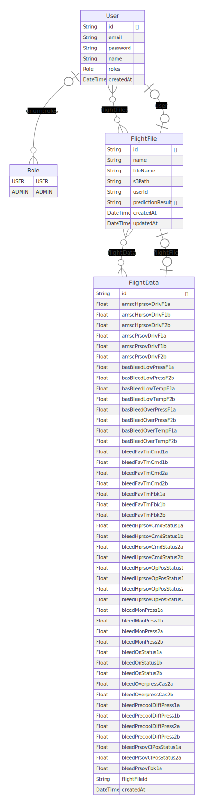

# Prisma Entity Relationship Diagram Generator

Essa pasta **diagram** contém uma biblioteca para gerar diagramas de relacionamento de entidades (Entity Relationship Diagram - ERD) para o bancos de dados construído com o Prisma.

## Descrição

O Prisma Entity Relationship Diagram Generator é uma ferramenta que permite visualizar a estrutura do banco de dados criado com o Prisma por meio de diagramas de relacionamento de entidades. Esse diagrama fornecem uma representação visual das tabelas, colunas e relacionamentos presentes no banco de dados, facilitando a compreensão da sua arquitetura.

A biblioteca é desenvolvida em linguagem de programação JavaScript/TypeScript e utiliza a biblioteca de diagramação Graphviz para renderizar os diagramas. Ela integra-se perfeitamente com o Prisma, um poderoso ORM (Object-Relational Mapping) que simplifica o acesso e manipulação de bancos de dados.

## Recursos e funcionalidades

- Geração automática de diagramas ERD a partir do esquema do banco de dados Prisma.
- Suporte para diferentes formatos de saída, como PNG, SVG e PDF.
- Customização dos elementos do diagrama, como cores, estilos e disposição dos nós.
- Identificação visual de relacionamentos entre tabelas, incluindo chaves primárias e estrangeiras.
- Suporte a bancos de dados suportados pelo Prisma, como MySQL, PostgreSQL e SQLite.

## Como usar

1. Certifique-se de ter o Prisma instalado e configurado para se conectar ao seu banco de dados.
2. Instale a biblioteca Prisma Entity Relationship Diagram Generator através do gerenciador de pacotes do Node.js:
   ```bash
   npm install prisma-erd-generator
   ```
3. Rode os comandos dentro da pasta **diagram**:

```bash
   prisma generate
```

```bash
   prisma db push
```

4. O diagrama ERD será gerado e salvo em um arquivo com o formato especificado `.svg`.

## Exemplo de saída

Aqui está um exemplo de diagrama ERD gerado pela biblioteca Prisma Entity Relationship Diagram Generator:


## Considerações finais

A biblioteca Prisma Entity Relationship Diagram Generator simplifica a visualização e compreensão da estrutura do banco de dados criado com o Prisma. Com ela, é possível gerar diagramas ERD de forma automatizada, facilitando a documentação e a comunicação entre os desenvolvedores e as partes interessadas no projeto.

**Nota:** Certifique-se de consultar a documentação oficial da biblioteca para obter mais informações sobre a configuração e uso adequado do Prisma Entity Relationship Diagram Generator.
